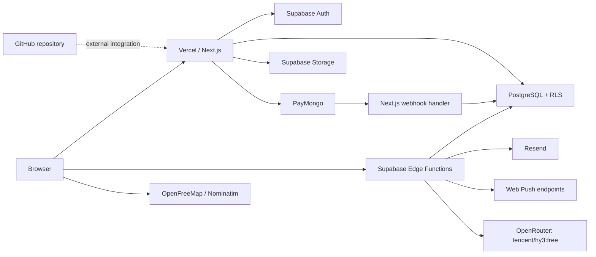
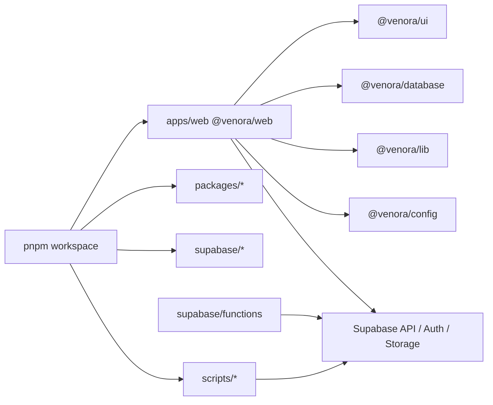

# Venora — Technical System Guide

Venora is a Philippine venue discovery and event marketplace. Customers discover
venues and request bookings; venue owners manage venues and availability;
suppliers respond to eligible event inquiries; event coordinators support org
workflows; administrators moderate marketplace, payment, and reporting.

This README is the **Technical System Guide**: architecture, module
relationships, local setup, environment configuration, build procedures, and
first-run troubleshooting. Deeper references live under [`docs/`](docs/README.md).

Review [known limitations](docs/known-limitations.md) before a production
release.

---

## Table of contents

1. [System architecture](#1-system-architecture)
2. [Repository and module relationships](#2-repository-and-module-relationships)
3. [Prerequisites](#3-prerequisites)
4. [Local development setup](#4-local-development-setup)
5. [Environment configuration](#5-environment-configuration)
6. [Build, validate, and common commands](#6-build-validate-and-common-commands)
7. [Optional integrations](#7-optional-integrations)
8. [Troubleshooting](#8-troubleshooting)
9. [Documentation map](#9-documentation-map)

---

## 1. System architecture

### 1.1 Deployment view



| Layer                        | Role                                                        |
| ---------------------------- | ----------------------------------------------------------- |
| Browser                      | Untrusted client; only `NEXT_PUBLIC_*` values may ship here |
| Next.js (`apps/web`)         | UI, SSR, Server Actions, Route Handlers, PayMongo webhook   |
| Supabase Auth                | Identity, sessions, email verification/reset                |
| PostgreSQL + RLS             | Durable state; final row-level authorization                |
| Supabase Storage             | Public/private object storage with path and MIME policies   |
| Edge Functions               | AI generation and some notification compute                 |
| PayMongo / Resend / Web Push | Checkout, email, push delivery                              |
| MapLibre / OpenFreeMap / OSM | Maps and geocoding (no Google Maps key)                     |

Full lifecycles (auth, booking, payment, storage, AI) are in
[docs/architecture.md](docs/architecture.md).

### 1.2 Stack

| Area      | Technology                                                            |
| --------- | --------------------------------------------------------------------- |
| App       | Next.js 16, React 19, TypeScript, Tailwind CSS 4, TanStack Query, Zod |
| Workspace | pnpm workspaces + Turborepo                                           |
| Backend   | Supabase Auth, PostgreSQL, RLS, Storage, Edge Functions (Deno)        |
| Payments  | PayMongo (active); Stripe is not a registered gateway                 |
| Messaging | Resend (email), Web Push (VAPID); SMS disabled                        |
| AI        | OpenRouter only; model locked to `tencent/hy3:free`                   |
| Maps      | MapLibre / OpenFreeMap / OSM Nominatim                                |

### 1.3 Trust boundaries

- UI visibility is **not** authorization. Server Actions, Route Handlers, and
  RLS must enforce access.
- Never put service-role or secret keys in `NEXT_PUBLIC_*` variables or Client
  Components.
- PostgreSQL RLS and Storage policies are the last data-protection boundary.

---

## 2. Repository and module relationships

### 2.1 Workspace layout

```text
venora/
  apps/web/                 Next.js App Router app, features, e2e
  packages/
    ui/                     Shared design-system components (@venora/ui)
    database/               Generated Supabase TypeScript types (@venora/database)
    lib/                    Framework-light shared utilities (@venora/lib)
    config/                 Shared TS / ESLint / Tailwind config (@venora/config)
  supabase/
    migrations/             Ordered SQL history (schema, RLS, Storage, RPCs)
    functions/              Deno Edge Functions + _shared helpers
    seed.sql                Local deterministic seed
    config.toml             Local Supabase configuration
  scripts/                  Validators, secret scanners, SQL printers
  docs/                     Architecture, ops, API, design, runbooks
```



### 2.2 Web app feature modules

Feature code lives under `apps/web/src/features/<feature>/` (UI, schemas,
actions, queries). Route groups under `apps/web/app/` include:

| Route group           | Audience                                        |
| --------------------- | ----------------------------------------------- |
| `(marketing)`         | Public landing and marketing pages              |
| `(auth)`              | Login, register, password reset                 |
| `(customer)`          | Bookings, favorites, venues, suppliers, account |
| `(venue-owner)`       | Venue dashboard, calendar, staff, analytics     |
| `(supplier)`          | Supplier dashboard, inquiries, availability     |
| `(event-coordinator)` | Coordinator/org staff flows                     |
| `(admin)`             | Marketplace moderation, disputes, audits        |

Placement rules and ownership: [docs/repository-structure.md](docs/repository-structure.md).

### 2.3 Database domains

Migrations under `supabase/migrations/` define identity, venues, bookings,
suppliers, payments, notifications, reviews, analytics/admin, and AI tables.
Storage buckets created by migrations:

| Bucket              | Visibility | Purpose                                  |
| ------------------- | ---------- | ---------------------------------------- |
| `venue-images`      | Public     | Venue gallery media                      |
| `avatars`           | Public     | User avatars / supplier portfolio assets |
| `verification-docs` | Private    | Partner verification (signed access)     |
| `review-photos`     | Public     | Review evidence photos                   |

Details: [docs/database.md](docs/database.md), [docs/storage.md](docs/storage.md).

---

## 3. Prerequisites

Install **all** of the following before a clean setup. Versions match
`package.json` `engines` and `packageManager`.

### 3.1 Required for app development

| Dependency     | Version / notes                                                   | Verify            |
| -------------- | ----------------------------------------------------------------- | ----------------- |
| Git            | Any current release                                               | `git --version`   |
| Node.js        | **20 or newer** (LTS recommended; CI/dev commonly uses 20–24)     | `node --version`  |
| pnpm           | **Pinned: 11.13.1** via `packageManager` (engines allow `>=9`)    | `pnpm --version`  |
| Network access | npm registry (`registry.npmjs.org`) and your Supabase project URL | Browser or `curl` |

Enable the pinned pnpm with Corepack (recommended):

```bash
corepack enable
corepack prepare pnpm@11.13.1 --activate
pnpm --version
```

### 3.2 Required credentials (minimum to boot the web app)

| Variable                        | Where to get it                   | Notes                       |
| ------------------------------- | --------------------------------- | --------------------------- |
| `NEXT_PUBLIC_SUPABASE_URL`      | Supabase project → Settings → API | Project URL                 |
| `NEXT_PUBLIC_SUPABASE_ANON_KEY` | Same                              | Publishable / anon key only |

Without these two, middleware and Supabase clients fail at startup
(“URL and Key are required”).

### 3.3 Optional — full local Supabase stack

| Dependency     | When needed                                                  | Verify               |
| -------------- | ------------------------------------------------------------ | -------------------- |
| Docker Desktop | Local Postgres, Auth, Storage, Studio, Edge Function serving | `docker info`        |
| Supabase CLI   | `supabase start`, `db reset --local`, local type generation  | `supabase --version` |

You can develop against a **hosted** non-production Supabase project without
Docker. Local resets, migration rehearsal, and `pnpm db:types` need Docker +
CLI.

### 3.4 Optional — tests and providers

| Dependency / tool   | When needed                                                     |
| ------------------- | --------------------------------------------------------------- |
| Playwright browsers | E2E / a11y: `pnpm --filter @venora/web exec playwright install` |
| Deno                | AI Edge unit tests: `pnpm test:ai`                              |
| PayMongo test keys  | Checkout and webhook work                                       |
| Resend test key     | Outbound email                                                  |
| VAPID key pair      | Web Push                                                        |
| OpenRouter API key  | AI Edge Functions                                               |
| `E2E_*` fixtures    | Authenticated Playwright roles                                  |

### 3.5 Platform matrix

Supported: current Windows, macOS, and Linux that can run Node 20+, pnpm, and
Git. PowerShell and bash/zsh examples are provided below.

---

## 4. Local development setup

Run every command from the **repository root** unless noted.

### 4.1 Clone and install

```bash
git clone https://github.com/Jassim3nidad/venora.git
cd venora
corepack enable
corepack prepare pnpm@11.13.1 --activate
pnpm install --frozen-lockfile
```

`--frozen-lockfile` fails if `package.json` and `pnpm-lock.yaml` disagree. That
is intentional; do not delete the lockfile to force install.

### 4.2 Create the web environment file

Next.js loads env from **`apps/web/.env.local`**, not the repo-root `.env`.

```bash
# macOS / Linux
cp .env.example apps/web/.env.local
```

```powershell
# Windows PowerShell
Copy-Item .env.example apps/web\.env.local
```

You may also start from `apps/web/.env.example` (web-focused template). Merge
missing keys from the root `.env.example` so validators and scripts see the same
names.

Edit `apps/web/.env.local` and replace placeholders. **Never commit**
`.env.local` or real secrets.

### 4.3 Choose a database target

#### Option A — Hosted non-production Supabase (fastest)

1. Create or open a dedicated **dev/test** project (never production for local
   experiments).
2. Set `NEXT_PUBLIC_SUPABASE_URL` and `NEXT_PUBLIC_SUPABASE_ANON_KEY` (and
   optionally `SUPABASE_URL` / `SUPABASE_ANON_KEY` aliases).
3. In Supabase Auth → URL configuration, allow:
   - Site URL: `http://localhost:3000` (or `http://127.0.0.1:3000` if you use that)
   - Redirect: `http://localhost:3000/auth/callback`
4. Apply pending migrations only with an approved process
   ([docs/migrations.md](docs/migrations.md)). Do not run destructive resets
   against hosted databases.

#### Option B — Local Supabase (Docker)

```bash
supabase start
supabase db reset --local
pnpm db:types
```

Copy the printed local URL and anon key into `apps/web/.env.local`.

| Command                     | Effect                                                               |
| --------------------------- | -------------------------------------------------------------------- |
| `supabase start`            | Starts local stack (needs Docker)                                    |
| `supabase db reset --local` | **Destroys local DB only**, reapplies migrations, runs `seed.sql`    |
| `pnpm db:types`             | Regenerates `packages/database/types/generated.ts` from local schema |
| `supabase stop`             | Stops local stack                                                    |

Never omit `--local` on `db reset`. Never hand-edit generated types.

### 4.4 Start the app

```bash
pnpm dev
```

Expected: Turborepo starts `@venora/web` (`next dev`). Open
[http://localhost:3000](http://localhost:3000).

Production-mode smoke after env is set:

```bash
pnpm build
pnpm --filter @venora/web start
```

### 4.5 First-run checklist

- [ ] `node --version` ≥ 20
- [ ] `pnpm --version` is 11.13.1 (or compatible ≥ 9 matching the lockfile)
- [ ] `pnpm install --frozen-lockfile` succeeded
- [ ] `apps/web/.env.local` exists and is gitignored
- [ ] `NEXT_PUBLIC_SUPABASE_URL` and `NEXT_PUBLIC_SUPABASE_ANON_KEY` are set
- [ ] Auth redirect allow-list includes `/auth/callback`
- [ ] `pnpm dev` serves the marketing home page without Supabase client crashes
- [ ] (Optional) Local stack: `supabase status` shows healthy services

---

## 5. Environment configuration

### 5.1 Scopes

| File / scope                     | Purpose                                          |
| -------------------------------- | ------------------------------------------------ |
| `.env.example`                   | Safe cross-service inventory (committed)         |
| `apps/web/.env.example`          | Web-focused template (committed)                 |
| `apps/web/.env.local`            | **Actual local Next.js env** (ignored; required) |
| `supabase/.env.example`          | Edge Function / local Supabase secret names      |
| Vercel / hosted Supabase secrets | Preview and production scopes                    |

Rules:

- Only `NEXT_PUBLIC_*` may reach the browser.
- Forbidden: `NEXT_PUBLIC_SUPABASE_SERVICE_ROLE_KEY` or any public secret key.
- Use dedicated test credentials; never production customer accounts.

Full matrix: [docs/environment-variables.md](docs/environment-variables.md).

### 5.2 Core application variables

| Variable                             | Required for                          | Class       |
| ------------------------------------ | ------------------------------------- | ----------- |
| `NEXT_PUBLIC_APP_URL`                | Canonical URLs, callbacks             | Public      |
| `NEXT_PUBLIC_SITE_URL`               | Optional URL fallback                 | Public      |
| `APP_URL` / `APP_BASE_URL`           | Edge / Playwright targets             | Server/test |
| `NEXT_PUBLIC_SUPABASE_URL`           | All Supabase clients                  | Public      |
| `NEXT_PUBLIC_SUPABASE_ANON_KEY`      | All Supabase clients                  | Public      |
| `SUPABASE_URL` / `SUPABASE_ANON_KEY` | Scripts / Edge aliases                | Server      |
| `SUPABASE_SERVICE_ROLE_KEY`          | Webhooks, refunds, privileged scripts | Server-only |

### 5.3 Integration variables (capability-required)

| Variable                  | Capability              |
| ------------------------- | ----------------------- |
| `PAYMONGO_SECRET_KEY`     | Checkout / refunds      |
| `PAYMONGO_WEBHOOK_SECRET` | Webhook signature check |
| `RESEND_API_KEY`          | Email delivery          |
| `RESEND_FROM`             | Verified sender         |
| `VAPID_PUBLIC_KEY`        | Web Push subscribe      |
| `VAPID_PRIVATE_KEY`       | Web Push send           |
| `VAPID_SUBJECT`           | `mailto:` contact       |
| `OPENROUTER_API_KEY`      | AI Edge Functions       |

### 5.4 Test-only variables

`NOTIFICATION_TEST_*` and `E2E_*` role fixtures are documented in
`.env.example` and [docs/environment-variables.md](docs/environment-variables.md).
They are required only for notification validators and Playwright auth specs.

### 5.5 Validate env (local)

```bash
node scripts/validate-env.mjs
```

Does not send email or mutate production. Provider smoke tests
(`validate-resend`, `validate-pipeline`) create external effects—use only with
dedicated fixtures.

---

## 6. Build, validate, and common commands

### 6.1 Everyday commands

| Command                  | Purpose                                    |
| ------------------------ | ------------------------------------------ |
| `pnpm dev`               | Start development servers (Turborepo)      |
| `pnpm build`             | Production build for all packages          |
| `pnpm lint`              | ESLint across workspace                    |
| `pnpm type-check`        | TypeScript `--noEmit`                      |
| `pnpm test`              | Vitest suite (`@venora/web`)               |
| `pnpm format`            | Prettier write                             |
| `pnpm format:check`      | Prettier check on changed files            |
| `pnpm docs:all:validate` | Docs / OpenAPI / design / technical checks |
| `pnpm clean`             | Clean package outputs and `node_modules`   |

### 6.2 Definition of done (before PR)

```bash
pnpm lint
pnpm type-check
pnpm test
pnpm build
pnpm docs:all:validate
```

CI-equivalent (stricter): `pnpm validate:ci` (includes format, database
contracts, Edge validation, secret scan, audit).

### 6.3 Focused test commands

| Command                 | Scope                                   |
| ----------------------- | --------------------------------------- |
| `pnpm test:unit`        | Fast Vitest subset                      |
| `pnpm test:integration` | Booking / calendar / payment / supplier |
| `pnpm test:database`    | Migration / contract validators         |
| `pnpm test:security`    | Security + RBAC tests                   |
| `pnpm test:e2e:smoke`   | Customer / venue / supplier auth smoke  |
| `pnpm test:e2e`         | Full Playwright suite                   |
| `pnpm test:ai`          | Deno AI config tests                    |
| `pnpm test:secrets`     | Scan changed content for secrets        |

Install Playwright browsers once before E2E:

```bash
pnpm --filter @venora/web exec playwright install
```

### 6.4 Database and Edge helpers

| Command                               | Purpose                                     | Safety                    |
| ------------------------------------- | ------------------------------------------- | ------------------------- |
| `pnpm db:types`                       | Regenerate DB types from **local** Supabase | Overwrites generated file |
| `pnpm db:types:validate`              | Validate type contracts without regen       | Read-only                 |
| `pnpm edge:validate`                  | Edge Function packaging checks              | Read-only                 |
| `supabase migration list --linked`    | Compare linked hosted history               | Needs linked project      |
| `supabase db push --dry-run --linked` | Preview hosted SQL                          | Preview only; not apply   |

---

## 7. Optional integrations

Configure only what you need. Missing optional keys disable that capability;
they do not block marketing pages if Supabase public vars are set.

| Integration   | Local setup summary                                                                |
| ------------- | ---------------------------------------------------------------------------------- |
| Supabase Auth | Site URL + `http://localhost:3000/auth/callback` allow-list; enable email provider |
| PayMongo      | Test-mode secret + webhook secret; webhook path `/api/webhooks/paymongo`           |
| Resend        | Test API key + allowed `RESEND_FROM` domain                                        |
| Web Push      | Generate VAPID pair; keep private key server-only                                  |
| Maps          | No API key; MapLibre / OpenFreeMap / Nominatim                                     |
| AI            | `OPENROUTER_API_KEY` via Edge secrets / `supabase/.env`; model fixed               |

Edge Function secrets: copy names from `supabase/.env.example`, then
`supabase secrets set` only for a confirmed project. Details:
[docs/getting-started.md](docs/getting-started.md),
[docs/payments.md](docs/payments.md),
[docs/notifications.md](docs/notifications.md),
[docs/ai.md](docs/ai.md).

---

## 8. Troubleshooting

| Symptom                                                | Likely cause                               | Safe fix                                                                                |
| ------------------------------------------------------ | ------------------------------------------ | --------------------------------------------------------------------------------------- |
| `URL and Key are required to create a Supabase client` | Env not in `apps/web/.env.local`           | Copy example into `apps/web/.env.local`; restart `pnpm dev`                             |
| `pnpm install` fails / lockfile mismatch               | Wrong pnpm/Node or dirty lock              | Use Node 20+, pnpm 11.13.1, `--frozen-lockfile`                                         |
| Port 3000 in use                                       | Another process                            | Stop the other process or set Next port                                                 |
| Auth redirect loop / wrong host                        | App URL or Supabase allow-list             | Align `NEXT_PUBLIC_APP_URL` and Auth redirect URLs                                      |
| RLS / Storage upload denied                            | Missing org membership, path, MIME, policy | Confirm role + path `{org}/{venue}/…`; see Storage runbook                              |
| Stale TypeScript DB types                              | Types older than migrations                | Local: `supabase db reset --local` then `pnpm db:types`                                 |
| Migration fails                                        | Order / duplicate version / drift          | Stop; preserve evidence; [runbook 03](docs/runbooks/03-supabase-migration-failure.md)   |
| PayMongo webhook rejects                               | Wrong secret or body parsing               | [runbook 10](docs/runbooks/10-paymongo-webhook-signature.md)                            |
| Build fails                                            | Missing env, TS, or route error            | Reproduce with `pnpm build`; [runbook 26](docs/runbooks/26-production-build-failure.md) |
| Google Maps “missing key”                              | Feature not used                           | Use MapLibre path; do not add Google keys                                               |
| OpenRouter / AI errors                                 | Missing Edge secret or model unavailable   | Set `OPENROUTER_API_KEY`; keep model `tencent/hy3:free`                                 |

Do **not** bypass RLS, expose the service-role key, or apply unreviewed SQL to
production to unblock local setup.

Broader matrix: [docs/troubleshooting.md](docs/troubleshooting.md). Incident
playbooks: [docs/runbooks/README.md](docs/runbooks/README.md).

---

## 9. Documentation map

| Topic                        | Document                                                                                                                   |
| ---------------------------- | -------------------------------------------------------------------------------------------------------------------------- |
| Doc index                    | [docs/README.md](docs/README.md)                                                                                           |
| Getting started (expanded)   | [docs/getting-started.md](docs/getting-started.md)                                                                         |
| Architecture                 | [docs/architecture.md](docs/architecture.md)                                                                               |
| Environment variables        | [docs/environment-variables.md](docs/environment-variables.md)                                                             |
| Repository structure         | [docs/repository-structure.md](docs/repository-structure.md)                                                               |
| Database / migrations        | [docs/database.md](docs/database.md), [docs/migrations.md](docs/migrations.md)                                             |
| Storage                      | [docs/storage.md](docs/storage.md)                                                                                         |
| Auth / RBAC                  | [docs/authentication.md](docs/authentication.md), [docs/authorization.md](docs/authorization.md)                           |
| Bookings / payments / notify | [docs/bookings.md](docs/bookings.md), [docs/payments.md](docs/payments.md), [docs/notifications.md](docs/notifications.md) |
| Testing                      | [docs/testing.md](docs/testing.md)                                                                                         |
| Deployment / CI              | [docs/deployment.md](docs/deployment.md), [docs/ci-cd.md](docs/ci-cd.md)                                                   |
| Contributing                 | [CONTRIBUTING.md](CONTRIBUTING.md)                                                                                         |
| Security reporting           | [SECURITY.md](SECURITY.md)                                                                                                 |
| API / OpenAPI                | [docs/api/specification.md](docs/api/specification.md), [docs/api/README.md](docs/api/README.md)                           |
| UI/UX inventory              | [docs/design/README.md](docs/design/README.md)                                                                             |

---

## Contributing and security

- Prefer short-lived branches and Conventional Commits (`fix:`, `feat:`,
  `docs:`, …). See [CONTRIBUTING.md](CONTRIBUTING.md).
- Never commit credentials, `.env.local`, production data, or dumps.
- Report vulnerabilities per [SECURITY.md](SECURITY.md).

No license file is present. Do not assume rights beyond those granted by the
repository owner.

---

## Quick start (summary)

```bash
git clone https://github.com/Jassim3nidad/venora.git
cd venora
corepack enable && corepack prepare pnpm@11.13.1 --activate
pnpm install --frozen-lockfile
cp .env.example apps/web/.env.local   # PowerShell: Copy-Item .env.example apps/web\.env.local
# Edit apps/web/.env.local → set NEXT_PUBLIC_SUPABASE_URL and NEXT_PUBLIC_SUPABASE_ANON_KEY
pnpm dev
```

Open [http://localhost:3000](http://localhost:3000). For migrations, seed,
Storage, Edge Functions, and providers, continue with
[Getting started](docs/getting-started.md).
