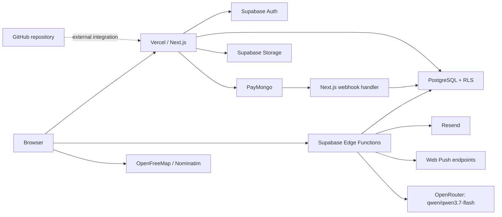
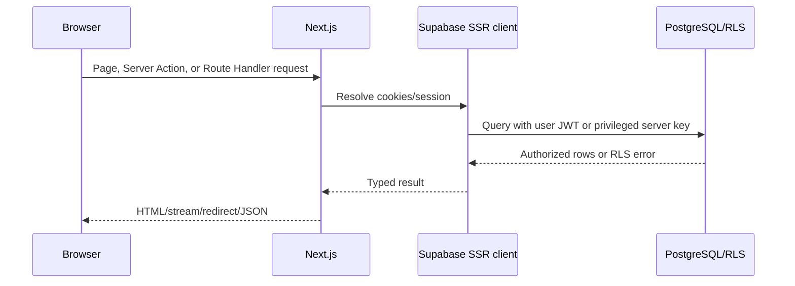
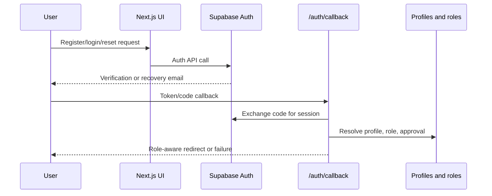
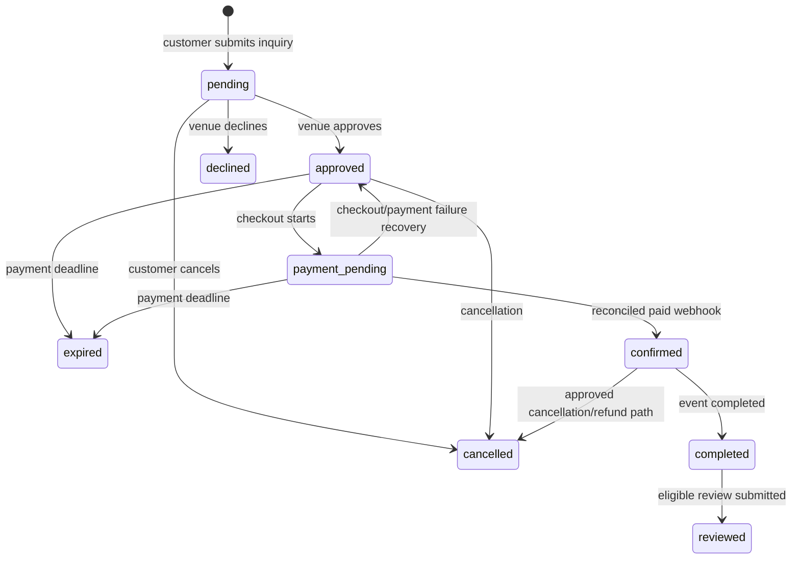
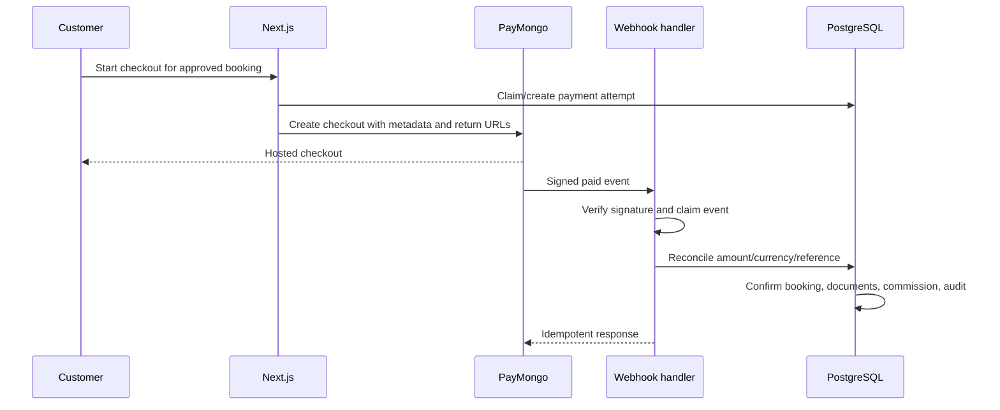
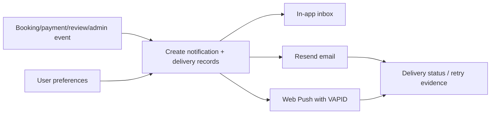
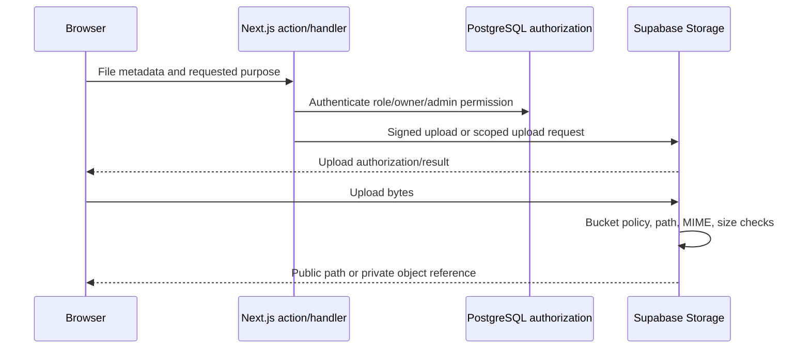
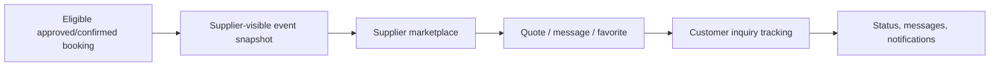
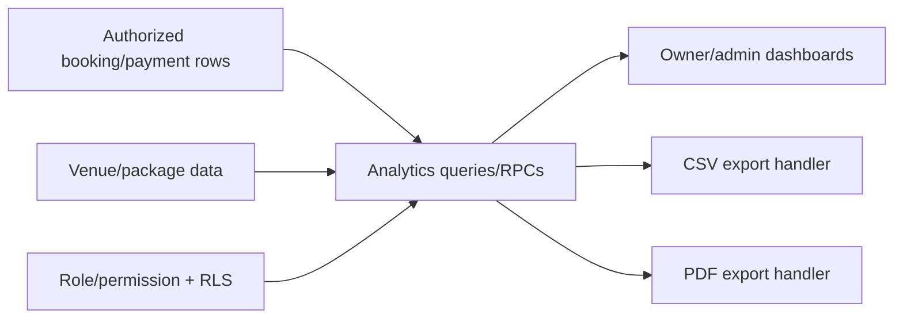
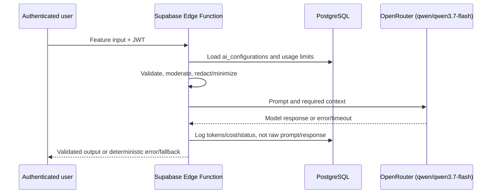

# System Architecture

This guide describes the implemented repository. Live provider dashboards,
deployed Supabase grants/function settings, and Vercel/GitHub integration were
not queried, so deployment claims are conditional.

## Deployment view

The browser is untrusted. Next.js server code and Edge Functions are trusted
application boundaries; service-role access is privileged. PostgreSQL RLS and
Storage policies are the final data authorization boundaries. External
providers receive only task-required data and may fail independently.

## Request lifecycle

Server Components fetch on the server and pass serializable data to Client
Components. Client Components own interaction state and browser APIs. Server
Actions validate input, resolve the current user, authorize, mutate through
Supabase, and revalidate/redirect. Route Handlers implement HTTP/webhook/export
surfaces. Response envelopes are currently mixed.

## Authentication lifecycle

`apps/web/proxy.ts` refreshes sessions and guards route groups. Server Actions
and Route Handlers must repeat server authorization; UI visibility is not a
control. RLS applies independently.

## Booking lifecycle

Database functions/triggers guard ownership, capacity, availability, duplicate
active dates, allowed transitions, and reconciliation. Snapshot columns preserve
booking/package/event and supplier inquiry context.

## Payment lifecycle

PayMongo is active. Maya has been retired and Stripe is not registered.
Webhooks can be duplicated, delayed, or reordered, so
claiming, reconciliation, and idempotent database operations are mandatory.

## Notification lifecycle

In-app notification creation is transactional where invoked by database
helpers. Email and push are external and can fail after database success;
delivery records support inspection/retry. SMS is disabled.

## Storage upload lifecycle

Four buckets have distinct visibility and limits. Current validation relies on
metadata/MIME/extension rather than magic-byte inspection. Private verification
documents require signed access.

## Supplier inquiry lifecycle

Supplier eligibility and snapshot functions reduce direct exposure of customer
booking data. Cross-tenant behavior still requires authenticated runtime RLS
testing; fallback supplier data can resemble actionable inventory.

## Analytics lifecycle

Analytics are database-derived; there is no external analytics provider key.
Exports must preserve tenant/permission scope and avoid caching another user's
data. Authenticated export paths remain runtime-unverified without fixtures.

## AI request lifecycle

OpenRouter is the only supported provider and `qwen/qwen3.7-flash` is the required
model. Alternate provider/model fallbacks are rejected. Limits and feature
settings are database-configured. External model calls require prompt-injection
defenses, data minimization, timeouts, cost limits, and safe failure behavior.

## Services and operational properties

| Service                   | Responsibility / auth / data                                    | Failure, retry, idempotency, risk                                                                                   |
| ------------------------- | --------------------------------------------------------------- | ------------------------------------------------------------------------------------------------------------------- |
| Next.js/Vercel            | UI, SSR, actions, handlers; cookies/JWT; user and business data | Requests may fail/build may drift; mutations must be idempotent; protect server secrets and confirm deployed commit |
| Supabase Auth             | Identity/session/email tokens                                   | Expired/misconfigured redirects fail; retry user flows safely; avoid account enumeration                            |
| PostgreSQL/RLS            | Durable state and final row authorization                       | Transactions roll back; retries must respect unique/idempotency guards; security-definer grants need review         |
| Edge Functions            | AI and booking-notification compute; JWT/service secrets        | External timeout/error; retry only idempotent work; deployed JWT config is externally verified                      |
| Storage                   | Public/private objects with policies                            | Signed URLs expire; retry uploads carefully; path/policy and MIME spoofing are risks                                |
| PayMongo                  | Hosted checkout, webhook events                                 | Duplicate/late events expected; signature, event claim, and reconciliation required                                 |
| Resend/Web Push           | Outbound delivery                                               | At-least-once/failed delivery possible; use delivery records and user preferences; never log credentials            |
| Map providers             | Tiles and geocoding for public venue data                       | Network/rate-policy failure; graceful map/search fallback; no Google Maps integration                               |
| OpenRouter                | Generated output and search intent using `qwen/qwen3.7-flash`   | Timeout, rate limit, unsafe output; bound context, validate output, log metadata only                               |
| GitHub/Vercel integration | Source and deployment orchestration                             | Configuration is outside repository and unverified; no repo workflow/vercel config exists                           |

Logging uses application/provider logs, database audit rows, payment event
records, notification delivery records, and AI usage metadata. No centralized
tracing/SLO stack is documented. Avoid logging secrets, raw verification files,
payment credentials, or unnecessary AI content.
