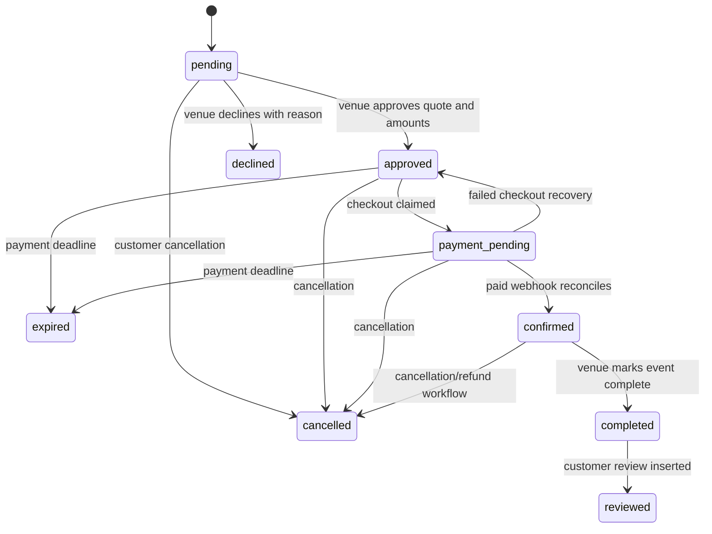

# Booking Lifecycle

Bookings begin as customer inquiries and become reservations only after venue
approval and reconciled payment. Database RPCs/triggers are authoritative for
transitions; direct status updates can bypass required amounts, timestamps,
notifications, and audit behavior and must not be used.

## Data and snapshots

Creation validates authenticated customer, venue, package, event date/type,
guest count/capacity, availability, duplicate active booking/date, and ownership
boundaries. Booking rows retain event and pricing context; later supplier
inquiry migrations add event-location and other snapshots so eligible suppliers
do not require unrestricted booking/customer access.

Declined, cancelled, expired, and reviewed are terminal in the documented
workflow. Confirmation is not a browser-return action; it is a verified payment
reconciliation result.

## Allowed transition matrix

| From                                     | To                | Initiator/control               | Required evidence                                                 |
| ---------------------------------------- | ----------------- | ------------------------------- | ----------------------------------------------------------------- |
| New                                      | `pending`         | Customer booking creation       | Valid venue/date/capacity and no conflicting active booking       |
| `pending`                                | `approved`        | Venue owner approval RPC        | Ownership, total/deposit, approval timestamp, audit/notification  |
| `pending`                                | `declined`        | Venue owner decline RPC         | Ownership and reason/status evidence                              |
| `pending`                                | `cancelled`       | Customer cancellation RPC       | Customer ownership and cancellation history                       |
| `approved`                               | `payment_pending` | Customer checkout claim RPC     | Approved amounts, checkout attempt/reference                      |
| `payment_pending`                        | `confirmed`       | PayMongo webhook reconciliation | Signature, claimed event, exact booking/reference/amount/currency |
| `payment_pending`                        | `approved`        | Checkout failure recovery       | Failed attempt and conditional status update                      |
| `approved`/`payment_pending`             | `expired`         | Scheduled database job          | Payment deadline passed and still unpaid                          |
| `approved`/`payment_pending`/`confirmed` | `cancelled`       | Authorized cancellation RPC     | Policy, actor, reason, refund implications/history                |
| `confirmed`                              | `completed`       | Venue workflow RPC              | Owned confirmed booking and completion timestamp                  |
| `completed`                              | `reviewed`        | Review trigger                  | Eligible customer review inserted                                 |

The cancellation RPC also accepts `pending`; it rejects other states. Whether a
confirmed cancellation requires/refunds money depends on recorded payment and
refund workflow, not only status.

## Actor/action matrix

| Actor       | Create                   | Approve/decline   | Start payment            | Cancel                          | Complete          | Review                         | View supplier snapshot                  |
| ----------- | ------------------------ | ----------------- | ------------------------ | ------------------------------- | ----------------- | ------------------------------ | --------------------------------------- |
| Customer    | Own                      | No                | Own approved             | Own allowed state               | No                | Own completed                  | Own inquiry tracking only               |
| Venue owner | No                       | Owned venue       | No                       | Authorized owned workflow       | Owned confirmed   | Respond through review feature | No general supplier view                |
| Supplier    | No                       | No                | No                       | No                              | No                | No                             | Eligible approved/confirmed events only |
| Coordinator | Partial UI/role behavior | Partial           | Partial                  | Partial                         | Partial           | Partial                        | Partial; runtime verification gap       |
| Admin       | No routine impersonation | Permission-scoped | No routine impersonation | Permission-scoped incident path | Permission-scoped | Moderation permissions         | Permission-scoped oversight             |

## Failure and recovery

| Failure                        | Integrity response                                              | Recovery                                                              |
| ------------------------------ | --------------------------------------------------------------- | --------------------------------------------------------------------- |
| Duplicate submit/race          | Unique/active-date and transaction guards reject one attempt    | Return existing/clear conflict; never create a second active booking  |
| Date becomes unavailable       | Availability/overlap guard rejects mutation                     | Ask user for another date; inspect duplicate `068` deployment state   |
| Invalid approval amounts       | Database constraint/RPC rejects approval                        | Correct quote; rerun approval RPC, not raw update                     |
| Checkout creation fails        | Attempt records failure and conditionally returns to `approved` | Retry idempotently from approved state                                |
| Paid webhook delayed/duplicate | Event claim and reconciliation prevent double settlement        | Replay/inspect the same provider event; do not manually confirm first |
| Paid but still pending         | No confirmation without verified reconciliation                 | Follow [paid booking runbook](runbooks/13-paid-booking-pending.md)    |
| Notification fails             | Booking transaction may succeed while external delivery fails   | Inspect delivery record and retry notification, not booking mutation  |
| Refund/cancel mismatch         | Keep audit and payment records; do not rewrite history          | Reconcile provider and database using payment/refund runbooks         |

Supplier visibility depends on eligible approved/confirmed relationship and
snapshot functions. Authenticated negative RLS tests remain necessary to prove
cross-account isolation. See [Payments](payments.md),
[Notifications](notifications.md), and [API Server Actions](api/server-actions.md).
