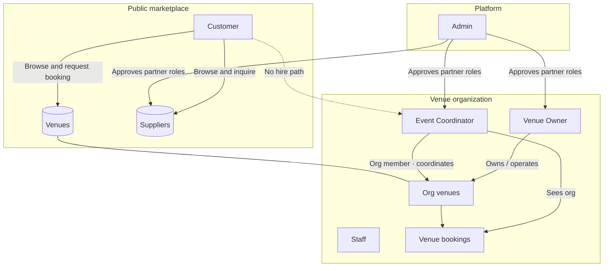
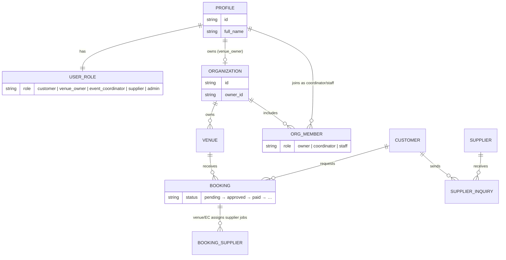
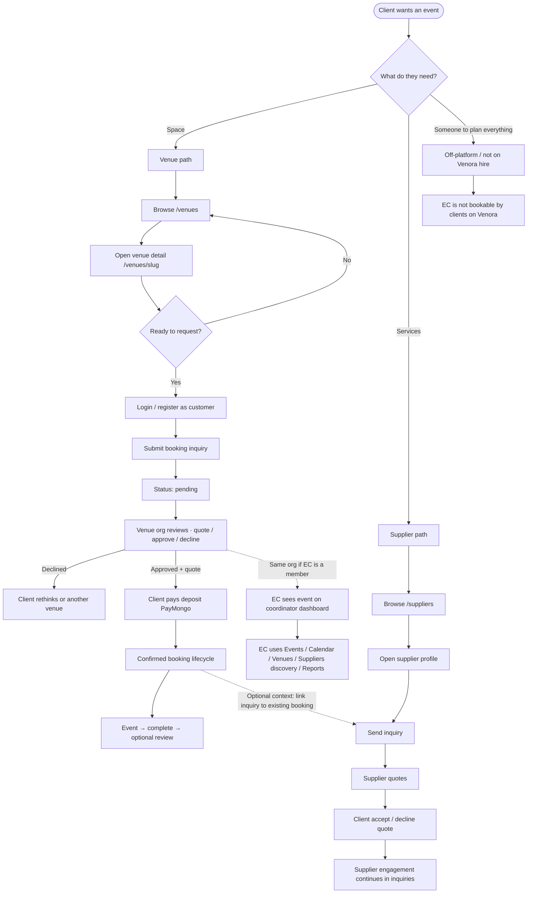
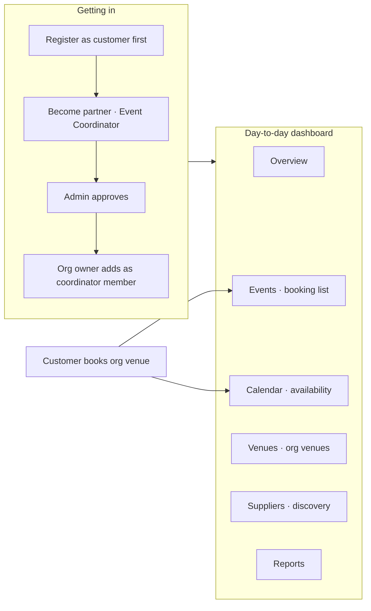
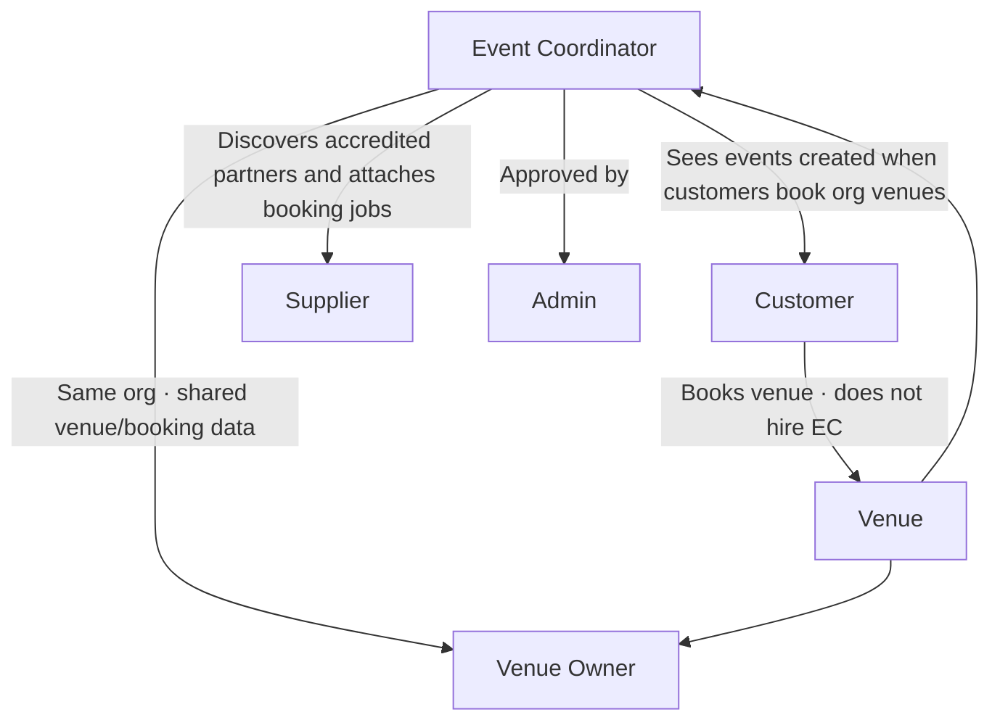

# Marketplace relationships and overall user flow

This document explains how **customers**, **venue owners**, **event coordinators**, and **suppliers** relate on Venora — especially what an Event Coordinator can and cannot do today.

It reflects **implemented product behavior**, not aspirational marketing copy. Companion inventories: [overall-system-user-flow.md](overall-system-user-flow.md) (system map + scenarios), [user-flows.md](user-flows.md), [role-experience-matrix.md](role-experience-matrix.md), [known-limitations.md](../known-limitations.md).

---

## Short answers

### Should a customer hire an Event Coordinator?

**No — not through Venora today.**

There is **no** customer-facing marketplace to find, request, or hire an Event Coordinator. Coordinators are a **partner role** meant to work as **organization staff** on venues that a Venue Owner (or org) already operates. They help manage **that organization’s** events, venues, and supplier discovery — they are not freelancers the client books from a public directory.

| Question                                               | Answer today                                                                                 |
| ------------------------------------------------------ | -------------------------------------------------------------------------------------------- |
| Can a client browse ECs and hire one?                  | **No**                                                                                       |
| Can an EC receive a booking from a customer account?   | **No** dedicated EC hiring flow                                                              |
| How does an EC get work on Venora?                     | Apply as partner → admin approval → be attached to a **venue organization** (org membership) |
| Who does the customer hire for the space?              | The **venue** (venue organization)                                                           |
| Who does the customer hire for catering/photo/AV/etc.? | **Suppliers**, via direct inquiry (separate from venue booking)                              |

Become-partner copy for EC (“Manage clients and plan events”) describes intent; the live product only delivers an **org-scoped coordinator dashboard**, not a client hiring channel.

---

## Who is who

### Roles in one line

| Role                  | Primary job on Venora                                                                                                         |
| --------------------- | ----------------------------------------------------------------------------------------------------------------------------- |
| **Customer**          | Discover venues and suppliers; request venue bookings; inquire for supplier quotes; pay deposits after venue approval.        |
| **Venue Owner**       | Operate org venues: listings, availability, packages, approve/decline booking inquiries, quotes, analytics.                   |
| **Event Coordinator** | Org-side operator: see coordinated venues’ events, calendar, venues, supplier discovery, reports. **Not** hired by customers. |
| **Supplier**          | Marketplace profile (catering, AV, décor, photo, etc.); respond to **customer** inquiries and quotes.                         |
| **Admin**             | Approve partner applications; moderate marketplace and platform workflows.                                                    |

Accounts use **one application role** at a time (partner approval replaces the customer role; it does not stack “customer + coordinator”).

---

## Relationship model (how they connect)

### How an Event Coordinator attaches (intended product model)

1. Person applies via **Become a partner** as `event_coordinator`.
2. **Admin** approves → account gets the `event_coordinator` role.
3. A **Venue Owner’s organization** adds them as `organization_members.role = coordinator`.
4. EC dashboard then scopes to that org’s **venues and bookings** (same org-scoped data helpers as venue owners for discovery/lists).

**Staff path:** Venue Owner invites from `/dashboard/staff` (org + email + venues +
permissions). Invitee accepts via email link (`/staff/accept`) or pending banner on
`/dashboard/coordinator`. Membership writes `organization_members`,
`venue_coordinator_assignments`, and grants `event_coordinator` role. Owners can
later change venues, permissions, suspend, or revoke.

### What is _not_ a relationship today

- Customer ↛ Event Coordinator (no hire, no messaging product, no EC directory).
- Venue booking ↛ automatic supplier job creation (venue/EC can explicitly
  attach accredited venue partners via `booking_suppliers`; package builder and
  supplier associations are implemented).
- Event Coordinator ↛ customer-hired planner CRM (org-scoped booking detail and
  messaging exist, but no public EC hire/directory or global client intake).

---

## Detailed client journey: venue + supplier (+ where EC sits)

This is the journey a **client (customer)** actually walks. EC appears only on the **venue side**, after a booking exists under an org that employs them.

### Step-by-step: looking for a venue

1. **Discover** — Public `/venues` → filters/cards → `/venues/[slug]`.
2. **Account** — Register/login as **customer** (required to book).
3. **Request** — `/venues/[slug]/book` → booking inquiry (`pending`).
4. **Venue-side decision** — Venue owner (or capable org member) approves/declines and sets quote.
5. **Pay** — After approval, customer pays deposit via PayMongo; webhooks confirm payment state.
6. **Run-up to event** — Booking lifecycle continues (cancel/refund/review rules per [bookings.md](../bookings.md)).
7. **Coordinator (side channel)** — If that venue’s org has an EC member, the EC can see the booking in **Coordinator → Events / Calendar**. The **customer never hired that person** inside Venora; the **venue organization** did.

### Step-by-step: looking for a supplier

1. **Discover** — Public `/suppliers` → profile.
2. **Inquire** — Authenticated customer sends a contact/inquiry (optionally tied to an existing venue booking for event context).
3. **Quote** — Supplier responds with quotes; customer accepts or declines.
4. **Independent of venue** — This path does **not** require a venue booking, and does **not** route through an Event Coordinator marketplace.

Venue owners / coordinators may **discover** suppliers, associate accredited
partners with venue packages, and **attach** those partners onto a booking
(`booking_suppliers` → supplier Jobs).

### Step-by-step: “how would I contact an Event Coordinator?”

**On Venora, you don’t — as a customer hiring flow.**

Practical realities:

| Intent                                          | What happens on Venora                                                                                                                   |
| ----------------------------------------------- | ---------------------------------------------------------------------------------------------------------------------------------------- |
| “I want a planner to run my wedding end-to-end” | **Not supported** as a bookable EC product. Client books **venue** and/or **suppliers** separately, or hires a planner **off-platform**. |
| “I’m a coordinator working for Garden Hill”     | Apply as EC → get approved → **org owner adds you** → use `/dashboard/coordinator/*`.                                                    |
| “I’m a customer messaging the venue’s planner”  | Use venue booking communications / venue processes if present; **no dedicated EC directory or hire CTA**.                                |

---

## Event Coordinator: how they “work around” the system today

Think of the EC as **ops staff for a venue org**, not a marketplace seller.

### What EC can do (partial product)

| Area          | Behavior                                                                                                                |
| ------------- | ----------------------------------------------------------------------------------------------------------------------- |
| **Events**    | List bookings across org venues; open links into booking detail routes (shared with venue-owner paths where allowed).   |
| **Calendar**  | Org-scoped availability calendar under `/dashboard/coordinator/calendar` (EC shell — not the venue-owner calendar URL). |
| **Venues**    | See venues belonging to their organization.                                                                             |
| **Suppliers** | Discover accredited partners and attach eligible suppliers to bookings.                                                 |
| **Reports**   | Org-oriented reporting surface.                                                                                         |

### What EC cannot do yet (important gaps)

- Own a public profile clients browse.
- Be hired or messaged as a service provider by customers.
- Reliable self-serve org attach (staff invite / accept live; email delivery depends on Supabase Auth).
- Full venue listing CRUD and a customer-hire/global CRM product.

### How EC relates to each actor

| Pair                                | Relationship                                                                                                                 |
| ----------------------------------- | ---------------------------------------------------------------------------------------------------------------------------- |
| **Customer ↔ Venue Owner**          | Commercial: inquiry → approval → payment for a **venue**.                                                                    |
| **Customer ↔ Supplier**             | Commercial: inquiry → quote → accept/decline for a **service**.                                                              |
| **Customer ↔ Event Coordinator**    | **None as a hire.** Indirect only: customer’s venue booking appears on EC dashboard if EC is org staff.                      |
| **Venue Owner ↔ Event Coordinator** | Organizational: VO/org employs or partners with EC via **organization_members**.                                             |
| **Venue Owner / EC ↔ Supplier**     | Discovery + attach accredited suppliers onto bookings as jobs; customer↔supplier inquiry remains a parallel commercial path. |
| **Admin ↔ all partners**            | Verification gate for venue owner / EC / supplier roles.                                                                     |

---

## End-to-end example (one event)

1. **Ana (customer)** finds **Blue Leaf Pavilion** on `/venues` and submits a booking for 12 Oct.
2. **Marco (venue owner)** of Blue Leaf’s organization reviews the inquiry, quotes, and Ana pays the deposit.
3. Separately, Ana browses `/suppliers`, inquires with a florist and a DJ, and accepts their quotes.
4. **Lina (event coordinator)** works for Blue Leaf’s org. After she is a `coordinator` member, she opens **Coordinator → Events** and sees Ana’s booking on the org calendar. She uses **Suppliers** discovery to plan, but Ana did **not** hire Lina on Venora — Marco’s org did.
5. **Admin** earlier approved Marco (venue owner), Lina (coordinator), and the florist/DJ (suppliers).

If Lina is not in `organization_members`, she cannot usefully “pick up” Ana’s event inside Venora, even with an approved EC role.

---

## Intended vs live product (don’t confuse these)

| Story                                         | Live?                                                                                 |
| --------------------------------------------- | ------------------------------------------------------------------------------------- |
| Venue marketplace + booking + deposit         | **Yes** (broadly implemented)                                                         |
| Supplier marketplace + inquiry + quotes       | **Yes** (broadly implemented)                                                         |
| Customer hires Event Coordinator              | **No**                                                                                |
| EC as org staff on venues                     | **Yes** — invite + accept + venue/permission scope                                    |
| Suppliers attached as jobs on a venue booking | **Yes** — venue/EC attachment writes `booking_suppliers`; supplier Jobs consumes them |
| EC full client-management product             | **No (partial dashboard only)**                                                       |

---

## Related docs

- [User flows](user-flows.md) — numbered journeys with Mermaid for auth, booking, payments, partners.
- [Role experience matrix](role-experience-matrix.md) — completeness by role.
- [Bookings](../bookings.md) — venue booking lifecycle.
- [Authorization](../authorization.md) — route/role guards.
- [Known limitations](../known-limitations.md) — product and UX gaps.

---

## Maintenance note

Update this file when:

- A customer-facing EC hire or directory ships.
- Org invite / membership onboarding becomes complete.
- Package-to-job behavior becomes automatic rather than an explicit venue/EC action.

Until then, treat **“customer hires an Event Coordinator on Venora”** as **out of product**.
