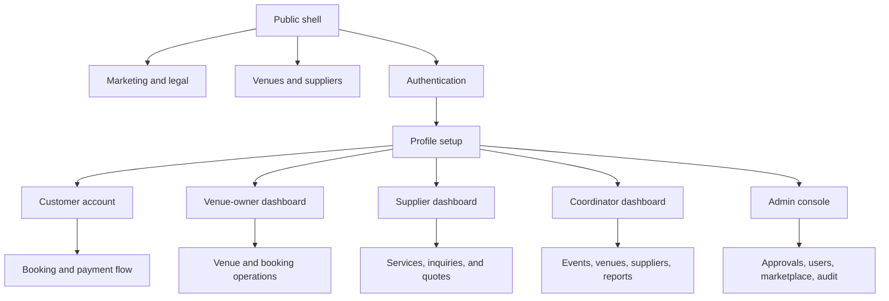

# Navigation map

## Route topology

## Public and customer navigation

- Marketing header: Home, Venues, Suppliers, Features, Pricing, and session entry.
- Customer marketplace header: venues, suppliers, bookings, favorites, help,
  notifications, settings, and profile depending on viewport/session.
- Footer destinations all resolve to implemented marketing, legal, safety, and
  resource routes.
- Confirmed defect: the desktop customer Help icon is a button with no handler or
  link; `/help` itself exists.
- Mobile marketing/customer menus collapse visually, but custom overlays do not
  expose dialog semantics, focus containment, or Escape dismissal in source.

## Role sidebars

| Role              | Canonical destinations                                                                                         | Guard                                                              |
| ----------------- | -------------------------------------------------------------------------------------------------------------- | ------------------------------------------------------------------ |
| Venue owner       | `/dashboard`, venues, bookings, calendar, packages, staff, reviews, analytics                                  | Venue-owner or admin layout plus ownership-aware data operations   |
| Supplier          | `/dashboard/supplier`, profile, services, inquiries, quotes, calendar, portfolio, reviews, bookings, analytics | Supplier or admin layout plus supplier-scoped operations           |
| Event coordinator | `/dashboard/coordinator`, events, venues, suppliers, reports                                                   | Coordinator or admin layout                                        |
| Administrator     | `/admin` plus 16 modules                                                                                       | Admin role, permission-filtered nav, page/action permission checks |

## Administrator permissions

| Destination            | Page permission        |
| ---------------------- | ---------------------- |
| Dashboard              | `admin.dashboard.view` |
| Applications           | `users.verify`         |
| Users and details      | `users.view`           |
| Venues and details     | `venues.view`          |
| Suppliers and details  | `suppliers.view`       |
| Bookings and inquiries | `marketplace.view`     |
| Reviews                | `marketplace.moderate` |
| Reports                | `reports.view`         |
| Disputes               | `disputes.view`        |
| Commissions            | `commissions.view`     |
| Marketplace            | `marketplace.view`     |
| AI configuration       | `ai_config.view`       |
| System settings        | `system_settings.view` |
| Administrators         | `admin_accounts.view`  |
| Audit logs             | `audit_logs.view`      |

Navigation visibility is not treated as authorization; source inspection found
corresponding server guards for these modules.

## Aliases and redirects

| Non-canonical route            | Canonical route            | Classification      |
| ------------------------------ | -------------------------- | ------------------- |
| `/dashboard/customer`          | `/account/dashboard`       | DEPRECATED redirect |
| `/account/inquiries`           | `/bookings?view=suppliers` | DEPRECATED redirect |
| `/account/inquiries/[id]`      | `/inquiries/[id]`          | DEPRECATED redirect |
| `/dashboard/admin`             | `/admin`                   | DUPLICATE re-export |
| `/dashboard/event-coordinator` | `/dashboard/coordinator`   | DUPLICATE re-export |
| `/dashboard/venue-owner`       | `/dashboard`               | DUPLICATE re-export |
