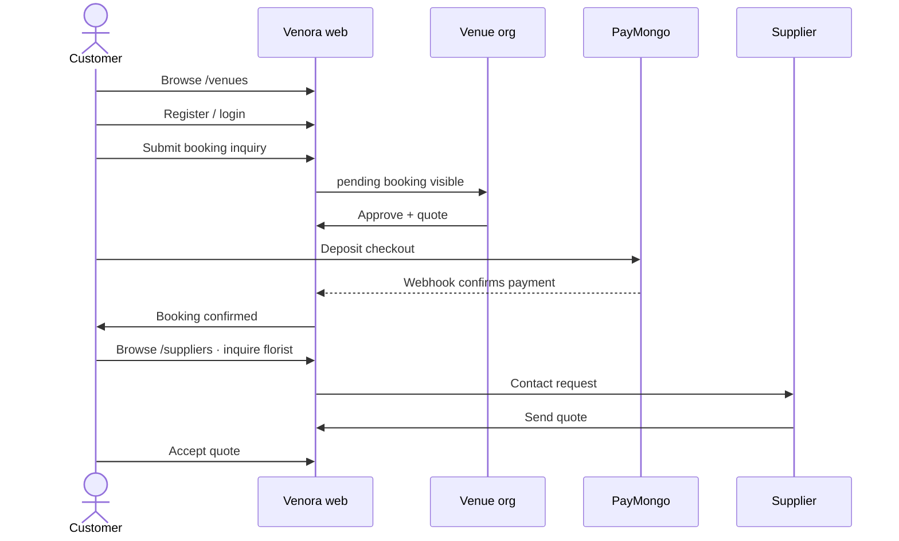
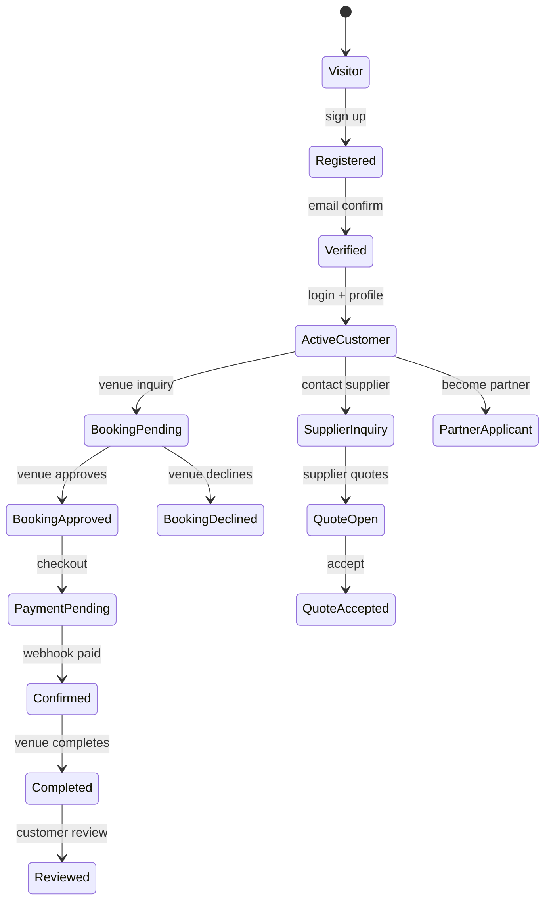
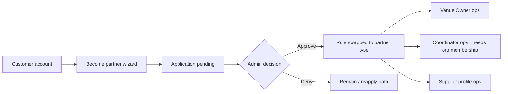
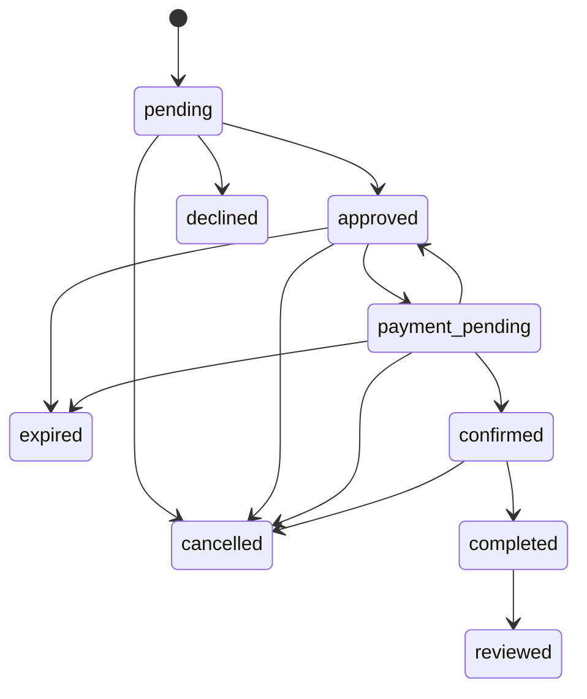

# Overall system user flow

Narrative map of how Venora works **end-to-end inside the product**, with real-life scenarios. For role relationships and “does a customer hire an Event Coordinator?”, see [marketplace-relationships-user-flow.md](marketplace-relationships-user-flow.md). For atomic numbered journeys, see [user-flows.md](user-flows.md). Booking state rules: [bookings.md](../bookings.md).

Status language matches the design inventory: this describes **source-backed** behavior; many authenticated paths are **not runtime-verified**.

---

## Big picture

Venora is a Philippine **venue discovery and event marketplace**. Inside the system, traffic moves through four loops:

1. **Public discovery** — anyone browses venues and suppliers.
2. **Customer commerce** — authenticated customers request venue bookings and supplier quotes.
3. **Partner operations** — venue owners, event coordinators (org-scoped), and suppliers run dashboards after admin approval.
4. **Platform governance** — admins verify partners and moderate marketplace workflows.

```mermaid
flowchart TB
  subgraph public["1 · Public"]
    Land[Landing]
    Venues[/venues]
    Suppliers[/suppliers]
    Auth[Register / login / verify]
  end

  subgraph customer["2 · Customer"]
    Book[Booking inquiry]
    Pay[PayMongo deposit]
    Favorites[Favorites]
    Inq[Supplier inquiries / quotes]
    Acct[Account · bookings · reviews]
  end

  subgraph partners["3 · Partners"]
    VO[Venue Owner dashboard]
    EC[Coordinator dashboard]
    SU[Supplier dashboard]
  end

  subgraph platform["4 · Platform"]
    Admin[Admin consoles]
    Apply[Become partner application]
  end

  Land --> Venues
  Land --> Suppliers
  Venues --> Auth
  Suppliers --> Auth
  Auth --> Book
  Auth --> Inq
  Book --> VO
  Book --> Pay
  Pay --> Acct
  Inq --> SU
  Auth --> Apply
  Apply --> Admin
  Admin --> VO
  Admin --> EC
  Admin --> SU
  VO -.->|org membership| EC
```

Accounts have **one application role** at a time. Partner approval **replaces** the customer role; it does not stack both.

---

## System lanes (who does what when)

| Phase | Customer | Venue owner | Event coordinator | Supplier | Admin |
| ----- | -------- | ----------- | ----------------- | -------- | ----- |
| Discover | Browse venues/suppliers | Listing appears if live | Uses discovery tools later | Listing appears if live | Monitors marketplace |
| Enter | Register → verify → login | Become partner → wait | Become partner → wait | Become partner → wait | Approves/denies applications |
| Transact | Booking inquiry; supplier inquiry | Approve/decline + quote | Sees org events if member | Quote on inquiries | Oversight / moderation |
| Pay / confirm | PayMongo checkout | Availability, calendar, packages | Calendar / events views | Jobs when rows exist (Phase 2 attach incomplete) | Payment/reporting tools |
| After event | Review; cancel/refund when eligible | Mark complete; respond to reviews | Reports / events list | Portfolio / reviews | Disputes placeholder |

---

## Core happy path (compressed)



Event Coordinators are **not** in this commercial sequence unless they work for the venue org and watch the booking after it exists.

---

## Real-life scenarios

### Scenario A — “Tagaytay garden wedding” (venue + two suppliers)

**People**

| Person | Role in Venora |
| ------ | -------------- |
| Ana Reyes | Customer (bride) |
| Marco Lim | Venue owner — *Hillcrest Gardens* organization |
| Bea Cruz | Supplier — floral design |
| Jam Ortiz | Supplier — mobile DJ / AV |

**Story**

Ana wants a 120-guest garden wedding in Tagaytay in October. She does not hire a planner on Venora; she books the garden and shops for flowers and music herself.

**End-to-end inside the system**

1. **Monday evening — discovery**  
   Ana opens Venora, filters `/venues` for Tagaytay / outdoor capacity, favorites two gardens, and opens *Hillcrest Gardens*.

2. **Tuesday — account**  
   She registers, verifies email, finishes profile setup, and returns to the venue.

3. **Tuesday — venue inquiry**  
   On `/venues/hillcrest-gardens/book` she picks the date, guest count, package, and submits. Booking status: **`pending`**.

4. **Wednesday morning — venue ops**  
   Marco logs into the venue-owner dashboard, opens Bookings, checks the calendar for conflicts, and **approves** with a deposit and total quote. Status: **`approved`**.

5. **Wednesday evening — payment**  
   Ana starts PayMongo checkout. While payment is in flight the booking may be **`payment_pending`**. PayMongo’s webhook reconciles the payment → **`confirmed`**. Returning from the browser alone does not confirm payment.

6. **Thursday — suppliers**  
   Ana browses `/suppliers`, opens Bea’s florist profile, and sends an inquiry (she can optionally reference the Hillcrest booking for event context). She does the same for Jam’s DJ listing.

7. **Friday — quotes**  
   Bea and Jam each open Supplier → Inquiries, send quotes. Ana accepts Bea, declines Jam’s first quote, and later accepts a revised DJ package after messaging.

8. **Event week / after**  
   Marco marks the venue booking **`completed`** after the wedding. Ana leaves a venue review (**`reviewed`**). Supplier reviews follow their supplier flows where available.

**What did not happen**

- No Event Coordinator was hired by Ana.
- Florists/DJ were **not** “attached” by Marco onto the venue booking through a finished Phase‑2 hire-to-booking UI; they were hired via **direct supplier inquiries**.

---

### Scenario B — “Declined date, second venue” (recovery path)

**People:** Carlo (customer), two venue owners.

1. Carlo requests *Skyline Loft* for a product launch; owner declines with a reason → booking **`declined`** (terminal for that inquiry).
2. Carlo favorites alternate venues, books *Harbor View Hall* for the same week.
3. Harbor View approves; Carlo pays → **`confirmed`**.

**System lesson:** One declined inquiry does not block new bookings elsewhere. Availability and “no conflicting active booking for the same customer/date rules” still apply on creation (see bookings docs).

---

### Scenario C — “Corporate offsite with org coordinator” (EC on the venue side)

**People**

| Person | Role |
| ------ | ---- |
| Priya Shah | Customer — company OPX organizes a 2-day offsite |
| Diego Santos | Venue owner — *Lakeview Pavilion* |
| Lina Gomez | Event coordinator — employee of Diego’s organization |

**Story**

Priya books Lakeview for her company’s offsite. Lina is Diego’s on-site coordinator. Customers never “shop for Lina”; Diego’s org adds her so she can operate events.

**End-to-end**

1. **Earlier (partners)**  
   Diego and Lina each applied via **Become a partner**. Admin approved Diego as `venue_owner` and Lina as `event_coordinator`. Diego invites Lina from **Staff Management**; she accepts via email link or the coordinator dashboard and becomes an `organization_members` coordinator with assigned venues and permissions.

2. **Customer booking**  
   Priya registers as customer, requests Lakeview for both dates (or primary event date per current booking UX), Diego’s team approves and she pays → **`confirmed`**.

3. **Coordinator work**  
   Lina opens `/dashboard/coordinator`:
   - **Events** — sees Priya’s booking in the org pipeline  
   - **Calendar** — `/dashboard/coordinator/calendar` for availability across org venues  
   - **Venues** — Lakeview details  
   - **Suppliers** — browses for AV/catering ideas; venue/EC can also attach accredited venue suppliers onto the booking as jobs  
   - **Reports** — org-oriented reporting  

4. **Priya’s parallel path**  
   Separately, Priya may still inquire with catering on `/suppliers` if her company contracts food directly.

**System lesson:** EC participates **after** the venue relationship exists, as **org staff**, not as a marketplace seller Priya hired.

---

### Scenario D — “Caterer joins Venora and wins a debut package” (supplier onboarding → inquire)

**People:** Nina (debutante’s mother, customer), Rico (caterer → supplier), Admin Mira.

1. Nina browses suppliers while planning a debut; Rico’s listing is not live yet.
2. Rico registers, goes to **Become a partner → Supplier**, uploads verification documents.
3. Mira approves in Admin → Applications; Rico’s role becomes `supplier`.
4. Rico completes business profile, services, portfolio, and availability calendar.
5. Nina finds Rico on `/suppliers`, sends inquiry for 150 plated dinners.
6. Rico quotes; Nina accepts. Engagement continues under customer inquiries / supplier quotes.

**System lesson:** Partner approval gates **role**, then marketplace presence depends on profile completeness. Commerce is **customer ↔ supplier inquiry**, not automatic assignment from venue bookings.

---

### Scenario E — “Deposit abandoned, then repaid” (payment recovery)

1. Customer booking is **`approved`**.
2. Checkout starts → **`payment_pending`**. Provider fails or user abandons.
3. System recovery returns eligible bookings toward **`approved`** so checkout can be retried (idempotent retries).
4. Successful webhook → **`confirmed`**.

If the payment deadline passes while unpaid, scheduled jobs can move the booking to **`expired`**.

**System lesson:** Confirmation is **webhook reconciliation**, not “I closed the PayMongo tab successfully.”

---

### Scenario F — “Customer cancels after confirm” (money + status)

1. Booking is **`confirmed`** with recorded payment.
2. Customer requests cancellation where policy allows → cancellation RPC + refund workflow as applicable.
3. Venue/admin paths exist for authorized cancellation; disputes UI is still a **placeholder** — not full case management.

Use payment/refund runbooks for money mismatches; do not hand-edit booking status to “fix” payments.

---

### Scenario G — “Unauthorized navigation” (role walls)

1. A supplier bookmarks `/dashboard/calendar` (venue-owner shell) → redirected to **unauthorized** (or blocked by route allowlist).
2. An event coordinator must use **`/dashboard/coordinator/...`**, not venue-owner URLs wrapped by the venue-owner layout.
3. An anonymous visitor opening `/dashboard/bookings` is sent to login.

**System lesson:** Proxy/RBAC prefixes and role layouts both enforce walls; “allowed in the spreadsheet” must match the **layout shell** the page lives under.

---

## Lifecycle maps by actor

### Customer lifecycle



### Partner lifecycle (owner / coordinator / supplier)



### Venue booking status (shared core)



---

## One weekend, three dashboards (system view)

Illustrates concurrent activity on the same wedding weekend.

| Time | Ana (customer) | Marco (venue owner) | Lina (coordinator, if on Marco’s org) | Bea (florist) |
| ---- | -------------- | ------------------- | ------------------------------------- | ------------- |
| Fri 10:00 | Submits venue inquiry | — | — | — |
| Fri 14:00 | — | Approves + quote | Sees pending/approved in Events once present | — |
| Fri 19:00 | Pays deposit | Calendar shows booked date | Calendar / events updated | — |
| Sat 09:00 | Inquires florist | — | Browses suppliers (planning) | Receives inquiry |
| Sat 16:00 | Accepts floral quote | — | — | Sends quote |
| Event day | Attends | On-site ops outside app | On-site coordination | Delivers flowers |
| After | Reviews venue | Marks booking complete | Reports / history | Portfolio update |

Customers experience **two commerce apps** (venue booking + supplier inquiries). Venue and coordinator experience **one org’s event pipeline**. Suppliers experience **their inbox of inquiries**.

---

## What to tell stakeholders (accurate)

| Claim | Accurate? |
| ----- | --------- |
| Clients find and book venues on Venora | **Yes** |
| Clients find and quote suppliers on Venora | **Yes** |
| Clients hire Event Coordinators on Venora | **No** |
| Coordinators help run an org’s venues/events | **Yes** (invite + scoped dashboard; supplier attach still Phase 2) |
| Venue “packs” suppliers onto a booking in-app | **Not finished** (schema Phase 2) |
| Admin verifies partners before they operate | **Yes** |
| PayMongo deposit confirms via webhook | **Yes** |

---

## Related documents

| Doc | Use when |
| --- | -------- |
| [marketplace-relationships-user-flow.md](marketplace-relationships-user-flow.md) | Roles, org model, EC hire question |
| [user-flows.md](user-flows.md) | 32 discrete flows with Mermaid |
| [role-experience-matrix.md](role-experience-matrix.md) | Completeness by role |
| [navigation-map.md](navigation-map.md) | Where screens live |
| [bookings.md](../bookings.md) | Status transitions and actors |
| [known-limitations.md](../known-limitations.md) | Gaps that affect real scenarios |

---

## Maintenance

Add or revise scenarios when a customer-facing EC hire ships, org invites go live, or venue↔supplier booking attach becomes a finished product path. Keep stories aligned with code and known limitations — do not document aspirational marketplace stories as live.
