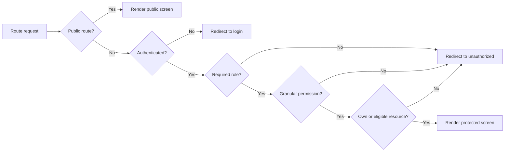

# Role experience matrix

| Capability              | Visitor                       | Customer                                   | Venue owner                            | Supplier                                           | Coordinator           | Administrator                             |
| ----------------------- | ----------------------------- | ------------------------------------------ | -------------------------------------- | -------------------------------------------------- | --------------------- | ----------------------------------------- |
| Browse venues/suppliers | Public                        | Public                                     | Public                                 | Public                                             | Dedicated discovery   | Marketplace monitoring                    |
| Account/profile         | Register/login                | Account screens                            | Shared account + owner shell           | Shared account + supplier profile                  | No dedicated settings | Admin user/profile controls               |
| Booking lifecycle       | Cannot submit unauthenticated | Inquiry, approval, payment, cancel, review | Review and decide owned-venue bookings | Eligible inquiries, quotes, jobs                   | Events overview only  | Monitor bookings/inquiries                |
| Venue operations        | Read-only                     | Read-only                                  | CRUD, media, availability, packages    | Read discovery                                     | Discovery             | Approve/moderate                          |
| Supplier operations     | Read-only                     | Inquiry                                    | Read discovery                         | Profile, services, portfolio, availability, quotes | Discovery             | Approve/moderate                          |
| Analytics/reports       | None                          | Dashboard summary                          | Analytics and exports                  | Analytics                                          | Reports route         | Reports, commissions, audit               |
| Notifications           | None                          | Inbox/preferences                          | Shared notification infrastructure     | Shared notification infrastructure                 | No dedicated route    | No dedicated management route             |
| Permission model        | Public                        | Authenticated resource ownership           | Role + ownership                       | Role + supplier scope                              | Role guard            | Role + granular permissions               |
| Runtime evidence        | Public pages checked          | None authenticated                         | None authenticated                     | None authenticated                                 | None authenticated    | None authenticated                        |
| Overall completeness    | Implemented                   | Broadly implemented, unverified            | Broadly implemented, unverified        | Broadly implemented, unverified                    | PARTIALLY IMPLEMENTED | Broadly implemented; disputes placeholder |

## Access outcomes

## Role-specific gaps

- Visitor: no branded not-found or general error recovery; customer desktop Help
  control is a dead end.
- Customer: payment documents/refunds are embedded rather than a complete
  receipt/invoice/refund-detail suite; privacy controls are placeholders.
- Venue owner: verification status and mutation feedback need authenticated QA;
  no owner-specific notification/settings pages.
- Supplier: event snapshot privacy needs multi-account negative testing; no
  dedicated notification/settings pages.
- Coordinator: booking detail, communication, notifications, and settings are
  missing; current product stops at overview/discovery/reports.
- Administrator: disputes are a guarded placeholder; payment/refund monitoring
  has no dedicated module; permission tier behavior was not runtime-tested.
