# User flows

Flow status reflects implemented source, not production acceptance. See
[authentication](../api/authentication.md), [Server Actions](../api/server-actions.md),
and [payment webhooks](../api/webhooks.md) for authoritative contracts.

## 1. Visitor browses venues — PARTIALLY IMPLEMENTED

- **Actor / start / preconditions:** Anonymous visitor at `/`; no session required.
- **Entry and steps:** Public navigation → `/venues` → filters/cards → `/venues/[slug]`.
- **Integration / status:** Public venue queries and `loadMoreVenuesAction`; browsing
  does not change state. No notification.
- **Outcome / recovery / permission:** Detail is success; empty/filter reset or retry
  is recovery. Confirmed load-more count defect and card identity risk remain.

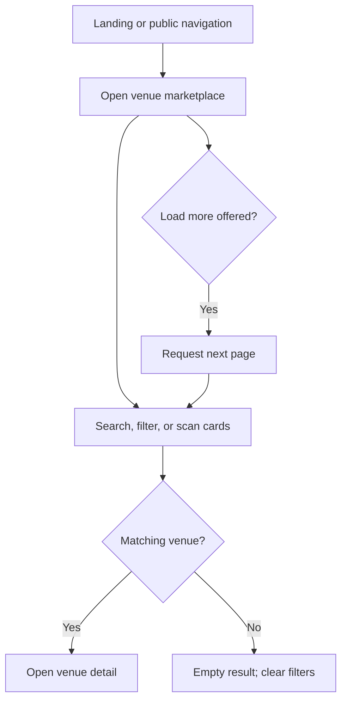
```mermaid
flowchart TD
  A["Landing or public navigation"] --> B["Open venue marketplace"]
  B --> C["Search, filter, or scan cards"]
  C --> D{"Matching venue?"}
  D -->|Yes| E["Open venue detail"]
  D -->|No| F["Empty result; clear filters"]
  B --> G{"Load more offered?"}
  G -->|Yes| H["Request next page"]
  H --> C
```

## 2. Visitor registers as a customer — IMPLEMENTED BUT NOT RUNTIME-VERIFIED

- **Actor / start / preconditions:** Visitor at `/register`; valid email and strong
  password, no active account assumed.
- **Steps / status:** `registerAction` validates and calls Supabase sign-up;
  `new → verification pending`. Verification email is generated by Supabase.
- **Outcome / recovery / permission:** Generic success avoids account disclosure;
  validation/provider errors remain on form. Public action; resend is available.

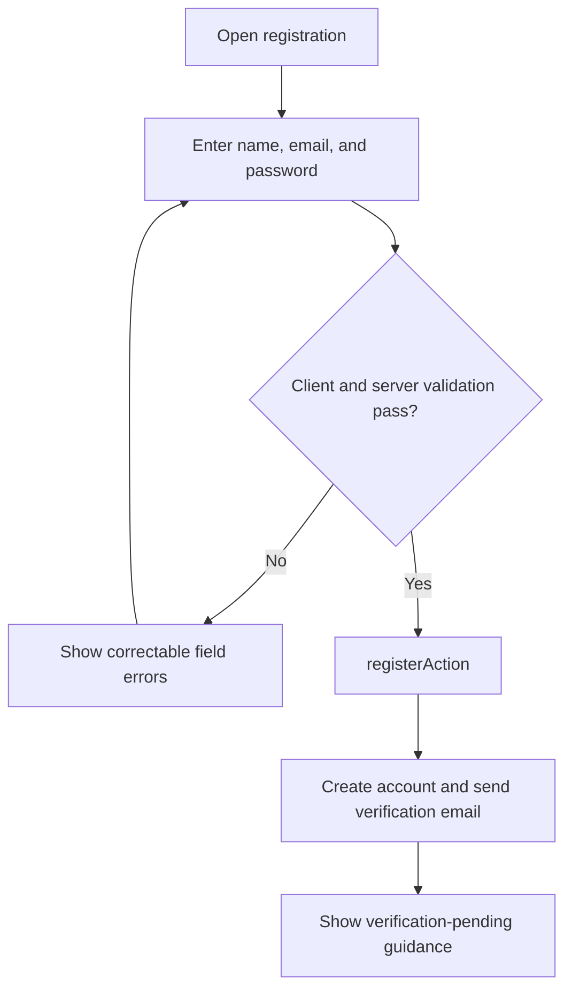
```mermaid
flowchart TD
  A["Open registration"] --> B["Enter name, email, and password"]
  B --> C{"Client and server validation pass?"}
  C -->|No| D["Show correctable field errors"]
  D --> B
  C -->|Yes| E["registerAction"]
  E --> F["Create account and send verification email"]
  F --> G["Show verification-pending guidance"]
```

## 3. Existing verified user registers again — IMPLEMENTED BUT NOT RUNTIME-VERIFIED

- **Actor / start / preconditions:** Existing verified user submits the same email
  at `/register` while signed out.
- **Steps / decision:** `registerAction` delegates account handling to Supabase and
  returns generic feedback rather than confirming account existence.
- **Outcome / recovery / permission:** User proceeds to `/login` or password reset.
  No role permission applies; provider-specific mail behavior was not run.

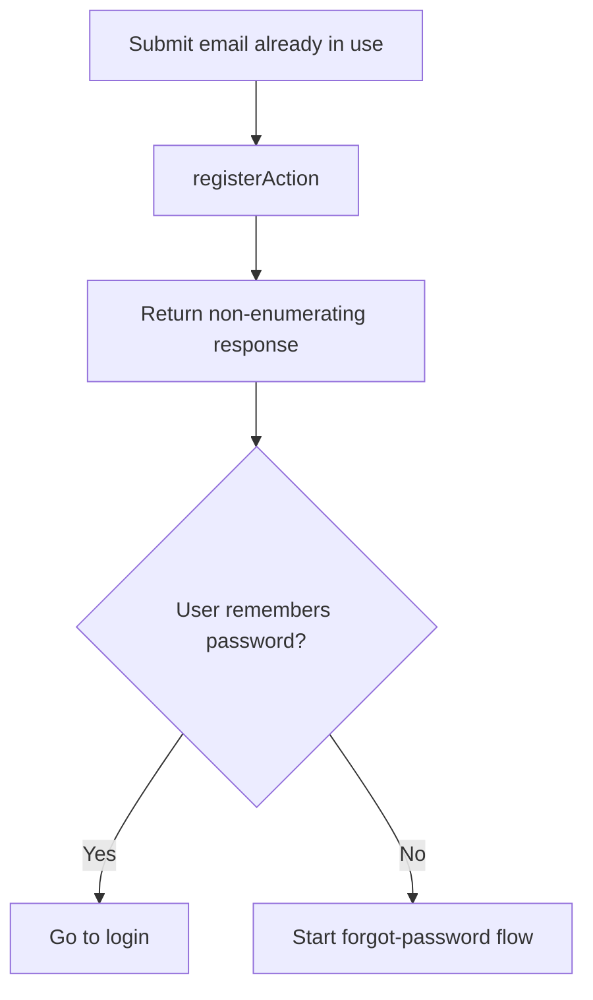
```mermaid
flowchart TD
  A["Submit email already in use"] --> B["registerAction"]
  B --> C["Return non-enumerating response"]
  C --> D{"User remembers password?"}
  D -->|Yes| E["Go to login"]
  D -->|No| F["Start forgot-password flow"]
```

## 4. Unverified user resends verification — IMPLEMENTED BUT NOT RUNTIME-VERIFIED

- **Actor / start / preconditions:** Unverified user at `/verify-email`; email is
  available and Supabase resend limits allow a request.
- **Steps / status:** `resendVerificationEmailAction`; account remains
  `verification pending`. Supabase sends mail.
- **Outcome / recovery / permission:** Confirmation message is success; validation,
  provider, or rate-limit feedback permits retry later. Public action.

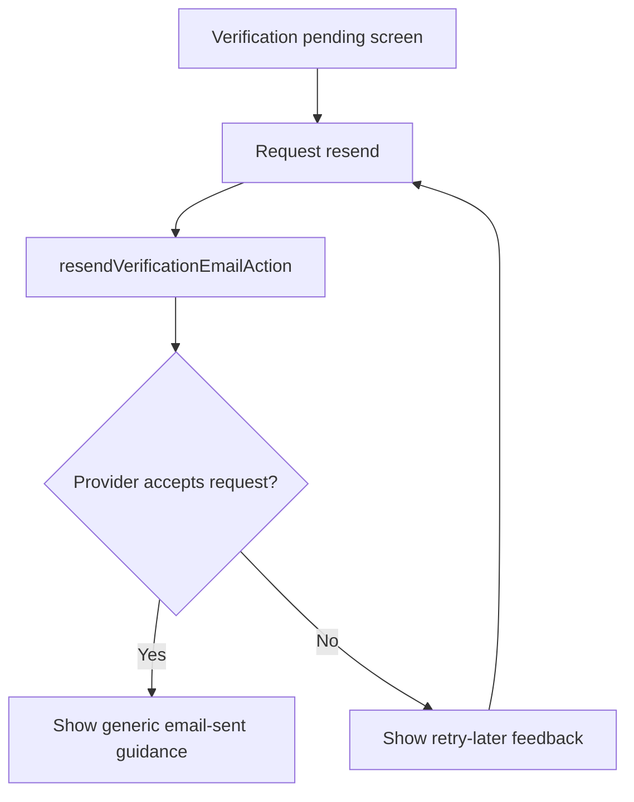
```mermaid
flowchart TD
  A["Verification pending screen"] --> B["Request resend"]
  B --> C["resendVerificationEmailAction"]
  C --> D{"Provider accepts request?"}
  D -->|Yes| E["Show generic email-sent guidance"]
  D -->|No| F["Show retry-later feedback"]
  F --> B
```

## 5. User completes email verification — IMPLEMENTED BUT NOT RUNTIME-VERIFIED

- **Actor / start / preconditions:** User opens a valid one-time verification URL.
- **Entry and steps:** `/confirm` or `/auth/callback` verifies token/code, establishes
  session, reads role/profile, then routes to setup or destination.
- **Status / recovery / permission:** `pending → verified`; expired/invalid link goes
  to safe confirmation error and resend/login. No privileged role is granted by URL.

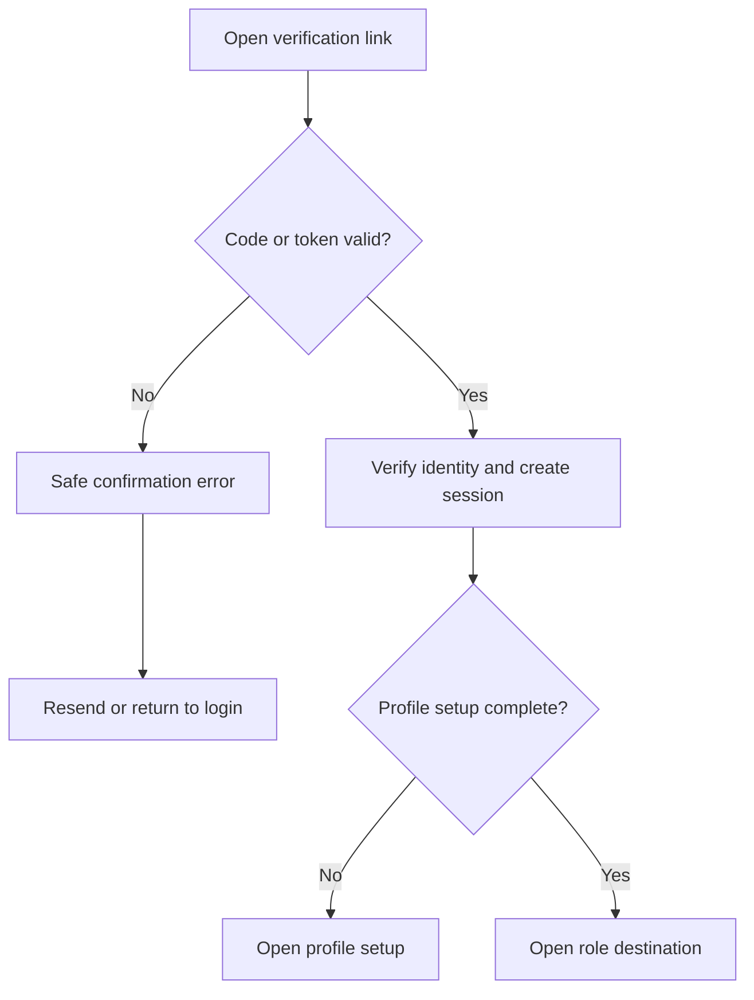
```mermaid
flowchart TD
  A["Open verification link"] --> B{"Code or token valid?"}
  B -->|No| C["Safe confirmation error"]
  C --> D["Resend or return to login"]
  B -->|Yes| E["Verify identity and create session"]
  E --> F{"Profile setup complete?"}
  F -->|No| G["Open profile setup"]
  F -->|Yes| H["Open role destination"]
```

## 6. User logs in — IMPLEMENTED BUT NOT RUNTIME-VERIFIED

- **Actor / start / preconditions:** Registered user at `/login`; valid credentials
  and any required verification.
- **Steps / integration:** `loginAction` authenticates, reads profile/roles, and
  resolves a safe redirect. Session changes from absent to active.
- **Outcome / recovery / permission:** Role destination is success; generic auth
  error or verification guidance allows retry/reset. Role guard still applies.

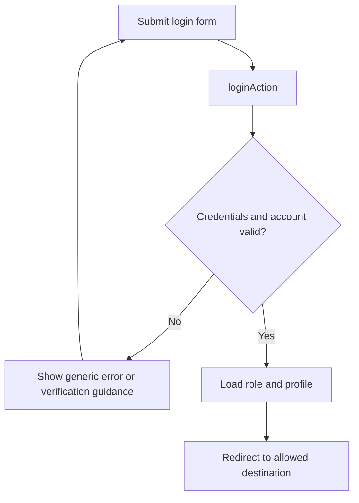
```mermaid
flowchart TD
  A["Submit login form"] --> B["loginAction"]
  B --> C{"Credentials and account valid?"}
  C -->|No| D["Show generic error or verification guidance"]
  D --> A
  C -->|Yes| E["Load role and profile"]
  E --> F["Redirect to allowed destination"]
```

## 7. User resets a forgotten password — IMPLEMENTED BUT NOT RUNTIME-VERIFIED

- **Actor / start / preconditions:** Signed-out user at `/forgot-password`, then a
  valid recovery session at `/reset-password`.
- **Steps / status:** `forgotPasswordAction` sends mail; recovery link establishes
  context; `resetPasswordAction` updates password.
- **Outcome / recovery / permission:** Login with new password is success. Expired
  link returns to a new reset request. Supabase Auth limits apply.

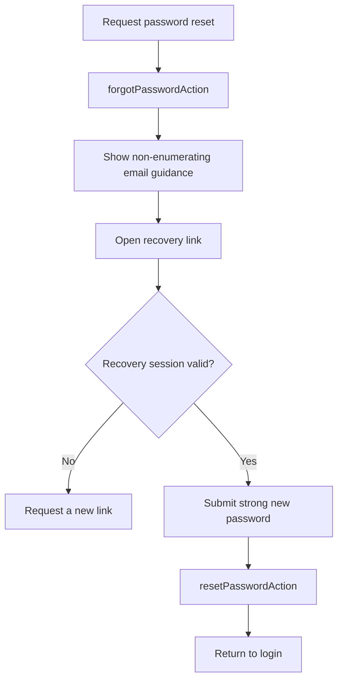
```mermaid
flowchart TD
  A["Request password reset"] --> B["forgotPasswordAction"]
  B --> C["Show non-enumerating email guidance"]
  C --> D["Open recovery link"]
  D --> E{"Recovery session valid?"}
  E -->|No| F["Request a new link"]
  E -->|Yes| G["Submit strong new password"]
  G --> H["resetPasswordAction"]
  H --> I["Return to login"]
```

## 8. Customer searches and filters venues — PARTIALLY IMPLEMENTED

- **Actor / start / preconditions:** Visitor or customer at `/venues`; public read
  access, optional session for favorite enrichment.
- **Steps / integration:** Search/filter controls update results; next-page path is
  intended to use `loadMoreVenuesAction`.
- **Outcome / recovery / permission:** Matching cards or empty state. Current UI can
  show `-1 more venues available` after all records and keeps load-more visible.

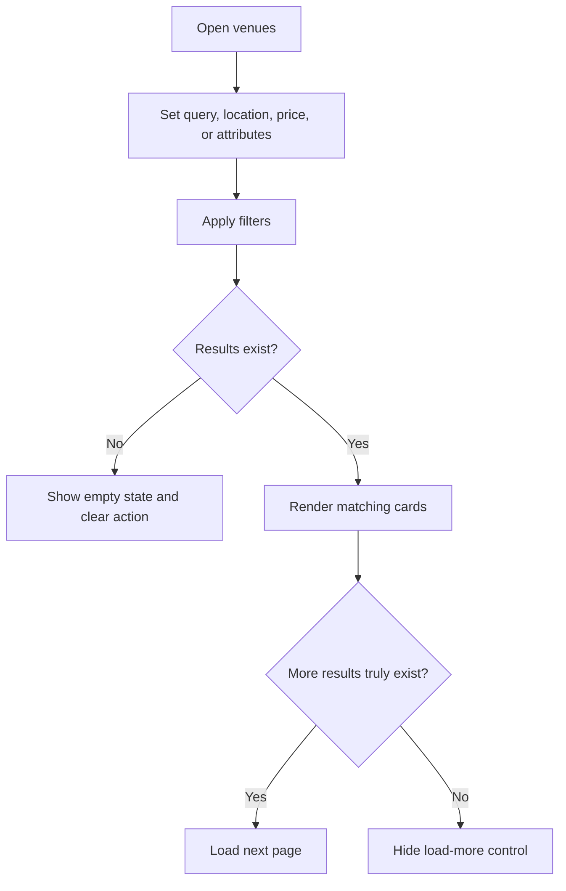
```mermaid
flowchart TD
  A["Open venues"] --> B["Set query, location, price, or attributes"]
  B --> C["Apply filters"]
  C --> D{"Results exist?"}
  D -->|No| E["Show empty state and clear action"]
  D -->|Yes| F["Render matching cards"]
  F --> G{"More results truly exist?"}
  G -->|Yes| H["Load next page"]
  G -->|No| I["Hide load-more control"]
```

## 9. Customer favorites a venue — IMPLEMENTED BUT NOT RUNTIME-VERIFIED

- **Actor / start / preconditions:** Authenticated customer on marketplace/detail;
  cannot favorite own venue.
- **Steps / transition:** Toggle invokes `toggleFavoriteAction`; `not saved ↔ saved`.
  No notification is documented.
- **Outcome / recovery / permission:** UI updates and `/favorites` reflects state;
  unauthenticated users go to login. Because toggle is non-idempotent, do not
  automatically retry ambiguous failures.

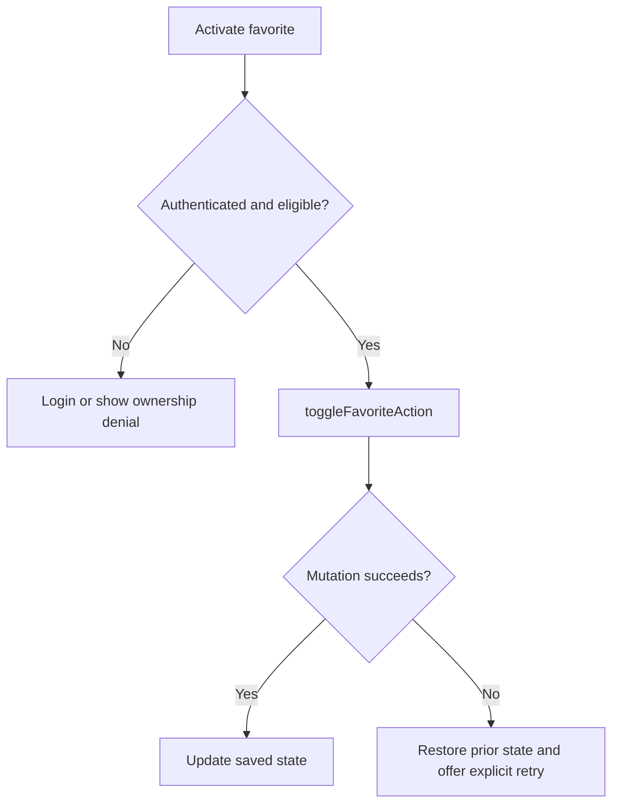
```mermaid
flowchart TD
  A["Activate favorite"] --> B{"Authenticated and eligible?"}
  B -->|No| C["Login or show ownership denial"]
  B -->|Yes| D["toggleFavoriteAction"]
  D --> E{"Mutation succeeds?"}
  E -->|Yes| F["Update saved state"]
  E -->|No| G["Restore prior state and offer explicit retry"]
```

## 10. Customer submits a booking inquiry — IMPLEMENTED BUT NOT RUNTIME-VERIFIED

- **Actor / start / preconditions:** Authenticated eligible customer at
  `/venues/[slug]/book`; future date, guests, and optional package are valid.
- **Steps / transition:** `POST /api/bookings` calls `create_booking_inquiry`;
  `none → pending inquiry`, history and notifications are written.
- **Outcome / recovery / permission:** Booking detail/confirmation is success;
  duplicate active inquiry returns conflict and form preserves correctable data.

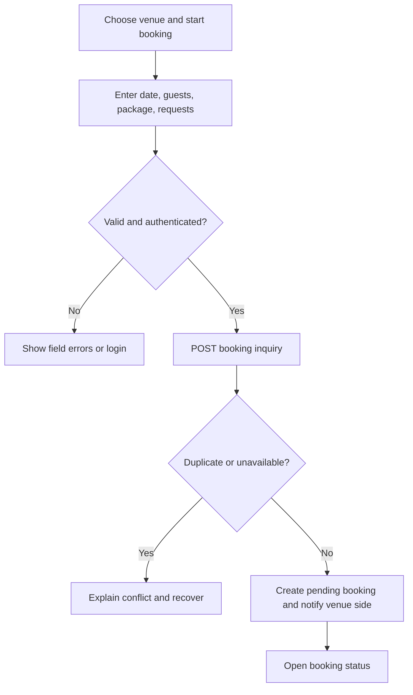
```mermaid
flowchart TD
  A["Choose venue and start booking"] --> B["Enter date, guests, package, requests"]
  B --> C{"Valid and authenticated?"}
  C -->|No| D["Show field errors or login"]
  C -->|Yes| E["POST booking inquiry"]
  E --> F{"Duplicate or unavailable?"}
  F -->|Yes| G["Explain conflict and recover"]
  F -->|No| H["Create pending booking and notify venue side"]
  H --> I["Open booking status"]
```

## 11. Venue owner reviews the inquiry — IMPLEMENTED BUT NOT RUNTIME-VERIFIED

- **Actor / start / preconditions:** Owner/member of the booked venue at
  `/dashboard/bookings/[id]`; booking is pending.
- **Steps:** Read customer-visible booking details, timeline/messages, availability,
  and quote inputs. `getBookingMessages` is RLS constrained.
- **Outcome / recovery / permission:** Owner chooses approve/decline; non-owner gets
  safe denial. Message actions can notify the participant.

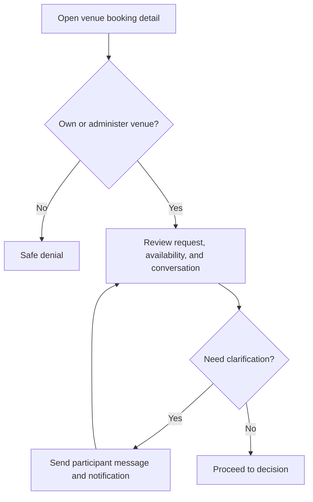
```mermaid
flowchart TD
  A["Open venue booking detail"] --> B{"Own or administer venue?"}
  B -->|No| C["Safe denial"]
  B -->|Yes| D["Review request, availability, and conversation"]
  D --> E{"Need clarification?"}
  E -->|Yes| F["Send participant message and notification"]
  F --> D
  E -->|No| G["Proceed to decision"]
```

## 12. Venue owner approves or rejects booking — IMPLEMENTED BUT NOT RUNTIME-VERIFIED

- **Actor / start / preconditions:** Authorized venue-side actor; pending booking.
- **Steps / transition:** `approveBookingAction` validates quote/deposit and calls
  `approve_booking_quote` (`pending → approved/payment required`); or
  `declineBookingAction` calls `decline_booking_request` (`pending → declined`).
- **Outcome / recovery / permission:** History, invoice/cache, and notifications
  update as applicable. Invalid state/amount/reason preserves current state.

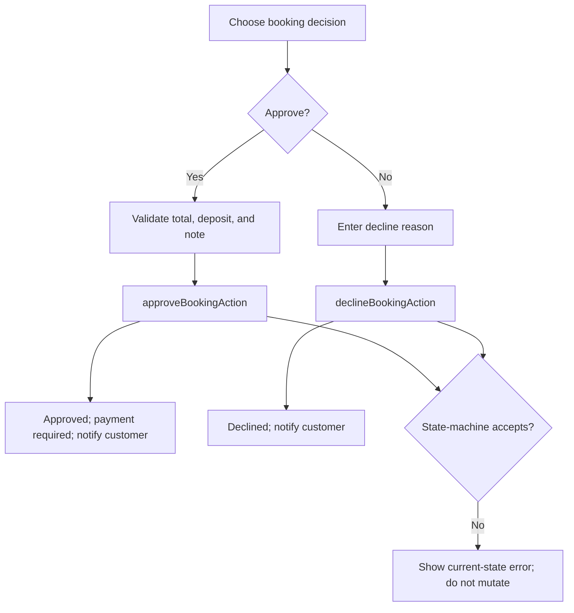
```mermaid
flowchart TD
  A["Choose booking decision"] --> B{"Approve?"}
  B -->|Yes| C["Validate total, deposit, and note"]
  C --> D["approveBookingAction"]
  D --> E["Approved; payment required; notify customer"]
  B -->|No| F["Enter decline reason"]
  F --> G["declineBookingAction"]
  G --> H["Declined; notify customer"]
  D --> I{"State-machine accepts?"}
  G --> I
  I -->|No| J["Show current-state error; do not mutate"]
```

## 13. Customer starts PayMongo checkout — IMPLEMENTED BUT NOT RUNTIME-VERIFIED

- **Actor / start / preconditions:** Booking customer at `/bookings/[id]/payment`;
  booking approved, deposit due, PayMongo configured.
- **Steps / transition:** `startBookingPaymentAction` or
  `POST /api/bookings/{id}/payment` calls `start_booking_payment`, creates/reuses a
  pending transaction, attaches checkout session, and returns hosted URL.
- **Outcome / recovery / permission:** Redirect is success; provider/config/state
  errors remain recoverable on payment screen. Only the booking customer may start.

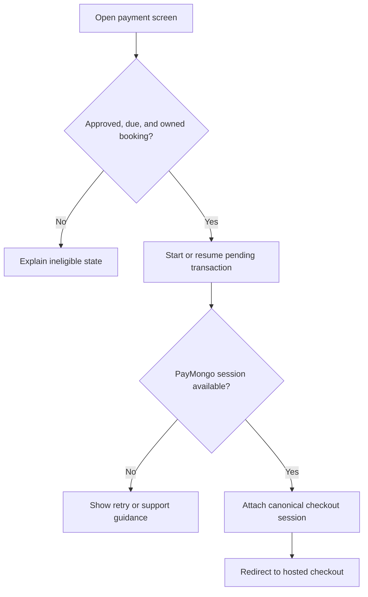
```mermaid
flowchart TD
  A["Open payment screen"] --> B{"Approved, due, and owned booking?"}
  B -->|No| C["Explain ineligible state"]
  B -->|Yes| D["Start or resume pending transaction"]
  D --> E{"PayMongo session available?"}
  E -->|No| F["Show retry or support guidance"]
  E -->|Yes| G["Attach canonical checkout session"]
  G --> H["Redirect to hosted checkout"]
```

## 14. Customer returns from PayMongo — IMPLEMENTED BUT NOT RUNTIME-VERIFIED

- **Actor / start / preconditions:** Customer exits hosted checkout. Success URL is
  `/bookings/{id}/confirmation`; cancel URL is `/bookings/{id}/payment`.
- **Steps / decision:** Return page reads current server state; browser return alone
  does not settle payment.
- **Outcome / recovery / permission:** Confirmed or pending reconciliation is shown;
  cancelled checkout can restart. Booking participant access is enforced.

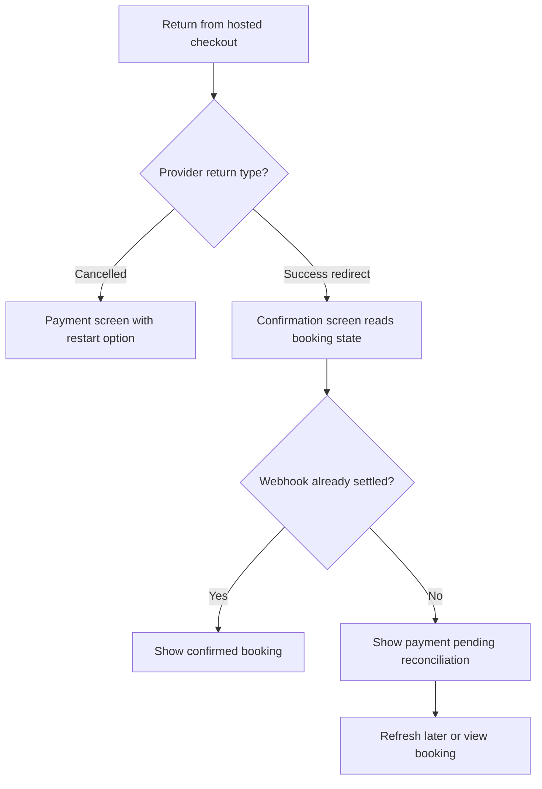
```mermaid
flowchart TD
  A["Return from hosted checkout"] --> B{"Provider return type?"}
  B -->|Cancelled| C["Payment screen with restart option"]
  B -->|Success redirect| D["Confirmation screen reads booking state"]
  D --> E{"Webhook already settled?"}
  E -->|Yes| F["Show confirmed booking"]
  E -->|No| G["Show payment pending reconciliation"]
  G --> H["Refresh later or view booking"]
```

## 15. Webhook settles and confirms booking — IMPLEMENTED; NOT BROWSER-VERIFIED

- **Actor / start / preconditions:** PayMongo server posts a signed event with a
  correlatable transaction, amount, currency, booking, and payment kind.
- **Steps / transition:** `POST /api/webhooks/paymongo` verifies signature, claims
  event, and calls `confirm_booking_payment`; `payment pending → paid` and
  `booking approved → confirmed`.
- **Outcome / recovery / permission:** Receipt, audit, history, commission, and
  notifications are created. Duplicate is safe; failure returns retryable 500.

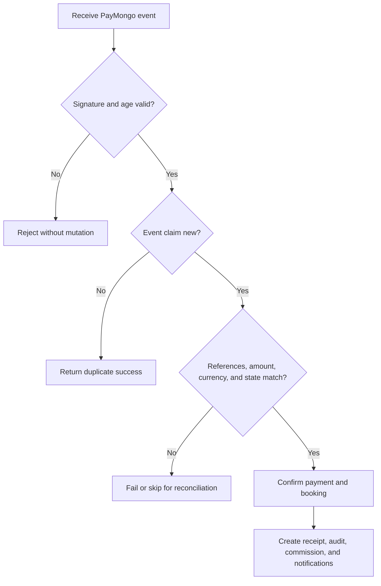
```mermaid
flowchart TD
  A["Receive PayMongo event"] --> B{"Signature and age valid?"}
  B -->|No| C["Reject without mutation"]
  B -->|Yes| D{"Event claim new?"}
  D -->|No| E["Return duplicate success"]
  D -->|Yes| F{"References, amount, currency, and state match?"}
  F -->|No| G["Fail or skip for reconciliation"]
  F -->|Yes| H["Confirm payment and booking"]
  H --> I["Create receipt, audit, commission, and notifications"]
```

## 16. Customer views receipt or invoice — IMPLEMENTED BUT NOT RUNTIME-VERIFIED

- **Actor / start / preconditions:** Authenticated booking customer with an issued
  invoice or settled receipt at `/account/payments`, `/account/transactions`, or
  booking detail.
- **Steps / data:** Read owned payment documents produced by approval/settlement.
  No mutation or notification is required.
- **Outcome / recovery / permission:** Document summary/view is success; absent
  document shows pending/unavailable safely. No dedicated receipt/invoice route.

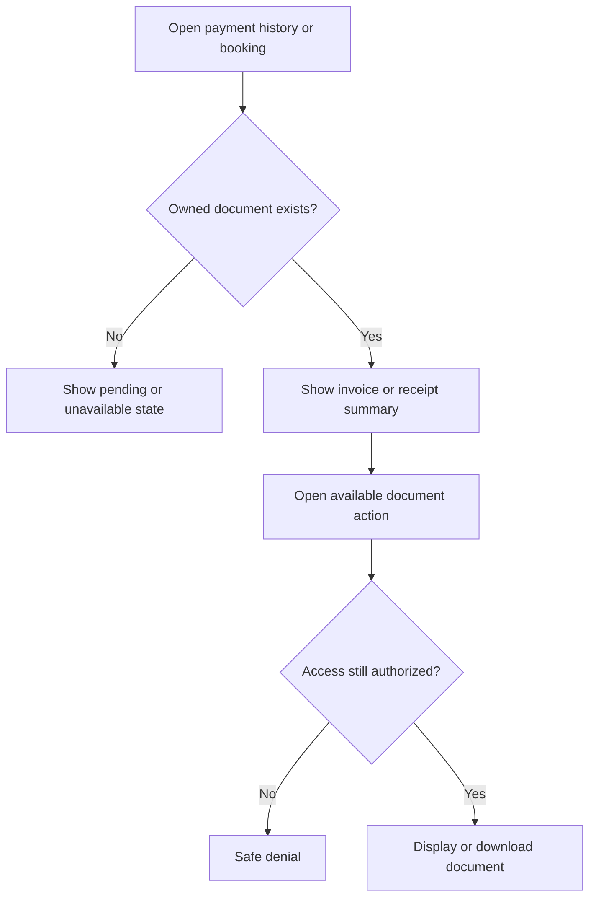
```mermaid
flowchart TD
  A["Open payment history or booking"] --> B{"Owned document exists?"}
  B -->|No| C["Show pending or unavailable state"]
  B -->|Yes| D["Show invoice or receipt summary"]
  D --> E["Open available document action"]
  E --> F{"Access still authorized?"}
  F -->|No| G["Safe denial"]
  F -->|Yes| H["Display or download document"]
```

## 17. Supplier receives an eligible event inquiry — IMPLEMENTED BUT NOT RUNTIME-VERIFIED

- **Actor / start / preconditions:** Approved supplier is related to an eligible
  booking/inquiry and opens `/dashboard/supplier/inquiries`.
- **Steps / transition:** Notification/query exposes the supplier-scoped inquiry;
  supplier may message, quote, or update eligible inquiry status.
- **Outcome / recovery / permission:** Inquiry appears without unrelated booking
  data. Empty list is safe; denied relation returns no protected record.

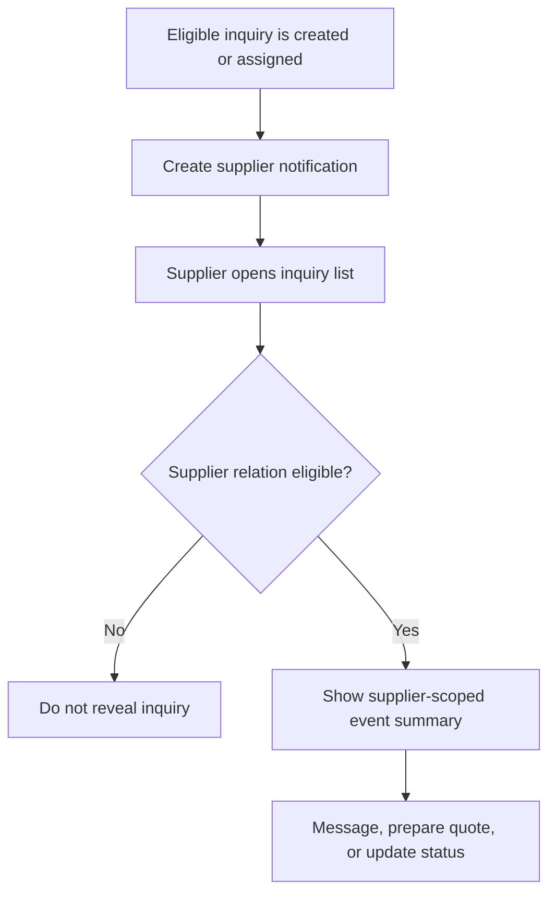
```mermaid
flowchart TD
  A["Eligible inquiry is created or assigned"] --> B["Create supplier notification"]
  B --> C["Supplier opens inquiry list"]
  C --> D{"Supplier relation eligible?"}
  D -->|No| E["Do not reveal inquiry"]
  D -->|Yes| F["Show supplier-scoped event summary"]
  F --> G["Message, prepare quote, or update status"]
```

## 18. Supplier views approved or confirmed event location — SOURCE-VERIFIED ONLY

- **Actor / start / preconditions:** Related supplier opens
  `/dashboard/supplier/inquiries/[id]`; booking approval/confirmation and supplier
  eligibility satisfy the server query.
- **Steps / decision:** Query returns venue name, date, time, guest count, and
  event-location snapshots only when allowed. No state mutation.
- **Outcome / recovery / permission:** Snapshot labels are success; missing or
  protected values remain unavailable. Multi-account negative runtime test is due.

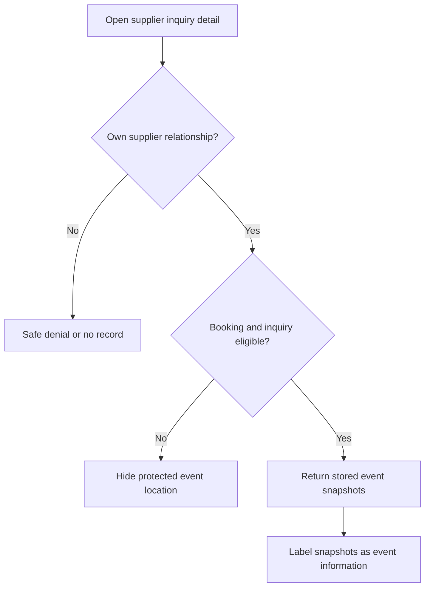
```mermaid
flowchart TD
  A["Open supplier inquiry detail"] --> B{"Own supplier relationship?"}
  B -->|No| C["Safe denial or no record"]
  B -->|Yes| D{"Booking and inquiry eligible?"}
  D -->|No| E["Hide protected event location"]
  D -->|Yes| F["Return stored event snapshots"]
  F --> G["Label snapshots as event information"]
```

## 19. Customer submits a verified review — IMPLEMENTED BUT NOT RUNTIME-VERIFIED

- **Actor / start / preconditions:** Booking customer at
  `/bookings/[id]/review`; booking completed and not already reviewed.
- **Steps / transition:** `submitBookingReviewAction` validates rating/comment and
  inserts review; optional upload then uses review-photo actions and storage.
- **Outcome / recovery / permission:** `eligible → reviewed`; stats/triggers update.
  Ineligible state explains why; validation preserves user input.

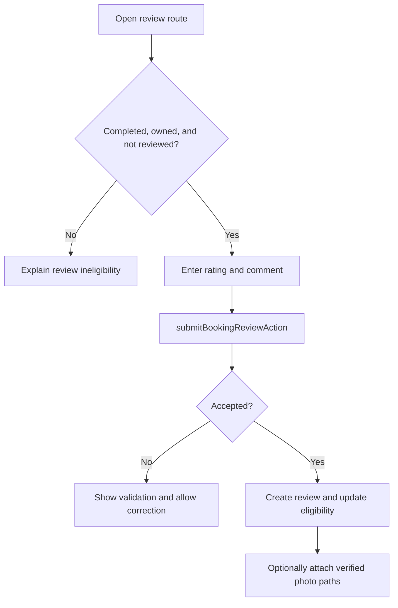
```mermaid
flowchart TD
  A["Open review route"] --> B{"Completed, owned, and not reviewed?"}
  B -->|No| C["Explain review ineligibility"]
  B -->|Yes| D["Enter rating and comment"]
  D --> E["submitBookingReviewAction"]
  E --> F{"Accepted?"}
  F -->|No| G["Show validation and allow correction"]
  F -->|Yes| H["Create review and update eligibility"]
  H --> I["Optionally attach verified photo paths"]
```

## 20. Venue owner applies and uploads verification documents — IMPLEMENTED BUT NOT RUNTIME-VERIFIED

- **Actor / start / preconditions:** Authenticated customer at
  `/account/become-partner`; no submitted pending/approved/denied application.
- **Steps / transition:** Select venue-owner role, complete wizard, request signed
  upload URLs, upload private files, finalize, and submit application;
  `draft → pending`.
- **Outcome / recovery / permission:** Admin notification is generated. Invalid
  MIME/size/path is removed or rejected; user corrects before submission.

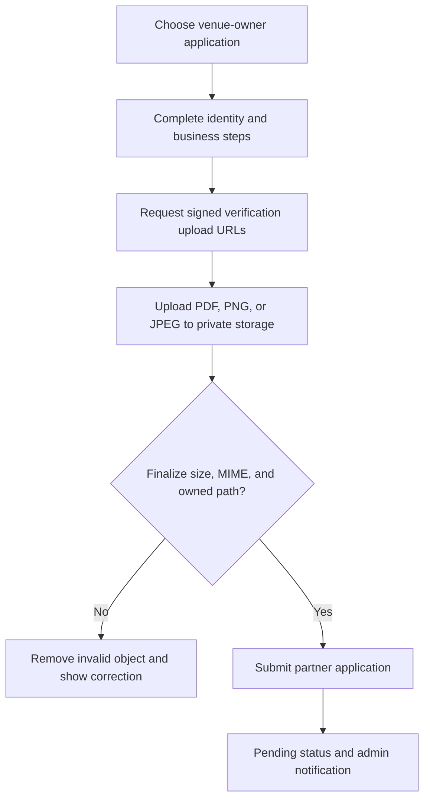
```mermaid
flowchart TD
  A["Choose venue-owner application"] --> B["Complete identity and business steps"]
  B --> C["Request signed verification upload URLs"]
  C --> D["Upload PDF, PNG, or JPEG to private storage"]
  D --> E{"Finalize size, MIME, and owned path?"}
  E -->|No| F["Remove invalid object and show correction"]
  E -->|Yes| G["Submit partner application"]
  G --> H["Pending status and admin notification"]
```

## 21. Supplier applies and uploads verification documents — IMPLEMENTED BUT NOT RUNTIME-VERIFIED

- **Actor / start / preconditions:** Authenticated customer at the same partner
  wizard; selects supplier role and category.
- **Steps / transition:** Signed private upload workflow and
  `submitPartnerApplicationAction`; `draft → pending`.
- **Outcome / recovery / permission:** Pending confirmation/admin notification;
  invalid documents or duplicate application return safe corrective feedback.

```mermaid
flowchart TD
  A["Choose supplier application"] --> B["Complete category and business details"]
  B --> C["Generate owned signed upload URLs"]
  C --> D["Upload verification documents"]
  D --> E{"Files finalize successfully?"}
  E -->|No| F["Correct or replace files"]
  E -->|Yes| G["submitPartnerApplicationAction"]
  G --> H["Pending status and admin notification"]
```

## 22. Administrator approves or rejects an application — IMPLEMENTED BUT NOT RUNTIME-VERIFIED

- **Actor / start / preconditions:** Admin with `users.verify` at
  `/admin/applications`; pending application.
- **Steps / transition:** Review private documents through short signed URL, then
  `approveApplicationAction` (`pending → approved`, role assigned) or
  `denyApplicationAction` (`pending → denied`, reason stored).
- **Outcome / recovery / permission:** Applicant notification and refreshed status;
  invalid/stale state does not apply a second decision. Confirmation UX needs QA.

```mermaid
flowchart TD
  A["Open pending application"] --> B{"users.verify permission?"}
  B -->|No| C["Unauthorized"]
  B -->|Yes| D["Review application and signed documents"]
  D --> E{"Approve?"}
  E -->|Yes| F["Approve and assign partner role"]
  E -->|No| G["Require denial reason"]
  G --> H["Deny application"]
  F --> I["Audit status and notify applicant"]
  H --> I
```

## 23. Administrator assigns roles or permissions — PARTIALLY IMPLEMENTED

- **Actor / start / preconditions:** Authorized admin on `/admin/users/[id]` or
  `/admin/administrators`; target is valid and safety invariants allow change.
- **Steps / transition:** `assignAdminTierAction` maps tier to permissions through
  `admin_assign_tier`; audit record and cache update.
- **Outcome / recovery / permission:** Tier is updated; `admin_roles.manage` is
  required and last-super-admin/self safety checks apply. Arbitrary per-user
  permission editing is not evidenced as a complete UI.

```mermaid
flowchart TD
  A["Open administrator detail"] --> B{"admin_roles.manage permission?"}
  B -->|No| C["Safe denial"]
  B -->|Yes| D["Select supported admin tier and reason"]
  D --> E{"Safety checks pass?"}
  E -->|No| F["Preserve current tier and explain"]
  E -->|Yes| G["assignAdminTierAction"]
  G --> H["Update tier-derived permissions and audit"]
```

## 24. User manages notification preferences — IMPLEMENTED BUT NOT RUNTIME-VERIFIED

- **Actor / start / preconditions:** Authenticated user at `/settings`.
- **Steps / transition:** `GET /api/notification-preferences` bootstraps/reads own
  row; `PATCH` validates channel toggles, quiet hours, and timezone; last write wins.
- **Outcome / recovery / permission:** Saved feedback is success; load/save errors
  expose retry. SMS is stored disabled. No cross-user access is allowed.

```mermaid
flowchart TD
  A["Open notification settings"] --> B["Load or bootstrap own preferences"]
  B --> C{"Load succeeds?"}
  C -->|No| D["Show retry state"]
  C -->|Yes| E["Edit channels and quiet hours"]
  E --> F["PATCH notification preferences"]
  F --> G{"Save succeeds?"}
  G -->|No| H["Keep edits and retry"]
  G -->|Yes| I["Show durable saved feedback"]
```

## 25. Venue owner accesses analytics — IMPLEMENTED BUT NOT RUNTIME-VERIFIED

- **Actor / start / preconditions:** Venue owner/admin at `/dashboard/analytics`;
  queries scope to owned/member venues.
- **Steps:** Load filters, KPIs, revenue/bookings/occupancy/conversion/packages,
  charts and tabular summaries. Read-only state.
- **Outcome / recovery / permission:** Data or understandable empty state; query
  error should allow retry. Real-data empty/error comprehension is unverified.

```mermaid
flowchart TD
  A["Open venue analytics"] --> B{"Role and venue scope valid?"}
  B -->|No| C["Safe denial"]
  B -->|Yes| D["Load scoped analytics"]
  D --> E{"Data available?"}
  E -->|No| F["Show no-data guidance"]
  E -->|Yes| G["Render KPIs, charts, and tables"]
  D -->|Error| H["Show retryable analytics error"]
```

## 26. Venue owner exports analytics — IMPLEMENTED BUT NOT RUNTIME-VERIFIED

- **Actor / start / preconditions:** Venue owner, coordinator, or admin with scoped
  venue analytics; valid date range and CSV/PDF choice.
- **Steps / API:** `GET /api/analytics/venue-owner/export?format=csv|pdf` validates
  session, role, scope, and dates, then returns a binary file. No DB mutation.
- **Outcome / recovery / permission:** Download is success; invalid filters/denial
  show error without exposing another venue’s data.

```mermaid
flowchart TD
  A["Choose CSV or PDF export"] --> B["Send scoped export request"]
  B --> C{"Session, role, scope, and dates valid?"}
  C -->|No| D["Show correction or permission error"]
  C -->|Yes| E["Build export from scoped analytics"]
  E --> F{"Generation succeeds?"}
  F -->|No| G["Offer explicit retry"]
  F -->|Yes| H["Download named file"]
```

## 27. Unauthorized user attempts a protected route — SOURCE-VERIFIED

- **Actor / start / preconditions:** Anonymous or wrong-role user requests account,
  dashboard, or admin URL.
- **Steps / decision:** Middleware/layout/page guard checks session, role, permission,
  and resource scope.
- **Outcome / recovery / permission:** Anonymous goes to login; authenticated denial
  goes to `/unauthorized`; no protected payload renders. Runtime checked only the
  denial page itself, not every redirect.

```mermaid
flowchart TD
  A["Request protected route"] --> B{"Authenticated?"}
  B -->|No| C["Redirect to login"]
  B -->|Yes| D{"Role and permission valid?"}
  D -->|No| E["Redirect to unauthorized"]
  D -->|Yes| F{"Resource scope valid?"}
  F -->|No| E
  F -->|Yes| G["Render protected screen"]
```

## 28. User encounters an empty state — INCONSISTENTLY IMPLEMENTED

- **Actor / start / preconditions:** Any user opens a valid collection with zero
  accessible records or applies filters with no match.
- **Steps:** Page-specific empty component/text describes absence and may offer a
  reset/create/browse action. No transition occurs.
- **Outcome / recovery / permission:** User exits or takes relevant action. Empty
  states are local rather than canonical, so naming/actions vary.

```mermaid
flowchart TD
  A["Load collection"] --> B{"Accessible records exist?"}
  B -->|Yes| C["Render list, grid, table, or chart"]
  B -->|No| D["Render named empty state"]
  D --> E{"Useful recovery exists?"}
  E -->|Reset| F["Clear filters"]
  E -->|Create or browse| G["Open allowed next route"]
  E -->|None| H["Dead end; backlog canonical action"]
```

## 29. User encounters a server error — MISSING SHARED EXPERIENCE

- **Actor / start / preconditions:** Any route query/render fails unexpectedly.
- **Steps:** No route-level `error.tsx` exists; behavior falls to framework/provider
  handling or page-local error text.
- **Outcome / recovery / permission:** Page-local retry may exist, otherwise refresh
  or navigation is the only recovery. Error UI must avoid technical/private detail.

```mermaid
flowchart TD
  A["Server render or query fails"] --> B{"Page has local error handling?"}
  B -->|Yes| C["Show local safe error"]
  C --> D["Retry or navigate away"]
  B -->|No| E["Framework fallback handles failure"]
  E --> F["No Venora-specific recovery contract"]
```

## 30. User encounters a missing page — MISSING CUSTOM EXPERIENCE

- **Actor / start / preconditions:** Any user enters an unknown URL.
- **Steps:** Next.js default not-found UI renders because no `not-found.tsx` exists.
- **Outcome / recovery / permission:** Browser back/manual navigation is available;
  no branded marketplace/dashboard recovery was observed.

```mermaid
flowchart TD
  A["Request unknown route"] --> B["Next.js resolves no page"]
  B --> C["Render default 404"]
  C --> D{"User knows a recovery route?"}
  D -->|Yes| E["Use browser or manual navigation"]
  D -->|No| F["Dead end without branded action"]
```

## 31. Customer requests cancellation or refund — IMPLEMENTED WHERE ELIGIBLE

- **Actor / start / preconditions:** Booking customer at
  `/bookings/[id]/cancel`; booking state permits cancellation. Refund additionally
  requires cancelled paid booking and refundable amount.
- **Steps / transition:** `cancelBookingAction` calls `cancel_booking_request`;
  active booking → cancelled. `POST /api/bookings/{id}/refund` creates refund,
  calls PayMongo, then webhook/synchronous completion moves pending/processing to
  completed or failed.
- **Outcome / recovery / permission:** History, availability, audit, and
  notifications update. Missing provider payment reference remains pending for
  manual settlement; no dedicated refund-detail route exists.

```mermaid
flowchart TD
  A["Open cancellation route"] --> B{"Customer and state eligible?"}
  B -->|No| C["Explain unavailable action"]
  B -->|Yes| D["Submit reason and cancel booking"]
  D --> E["Update history, availability, and notifications"]
  E --> F{"Paid amount refundable?"}
  F -->|No| G["Show cancellation complete"]
  F -->|Yes| H["Request PayMongo refund"]
  H --> I{"Provider result reconciled?"}
  I -->|Yes| J["Refund completed and notified"]
  I -->|No| K["Pending or failed; show support/retry state"]
```

## 32. Administrator reviews a dispute

- **Actor / start / preconditions:** Admin with `disputes.view` at
  `/admin/disputes`. Manage/resolve need `disputes.manage` /
  `disputes.resolve`.
- **Steps / status:** List/filter cases → open case → start review
  (`open` → `under_review`) → resolve or reject with notes. Customers raise
  from eligible booking detail; track at `/account/disputes`.
- **Outcome / recovery / permission:** Closed cases show resolution notes.
  Unauthorized viewers see safe empty/forbidden states; invalid transitions
  rejected by `update_dispute_status` RPC.

```mermaid
flowchart TD
  A["Open admin disputes"] --> B{"disputes.view?"}
  B -->|No| C["Safe unauthorized state"]
  B -->|Yes| D["List / filter cases"]
  D --> E["Open dispute case"]
  E --> F{"open?"}
  F -->|Yes + manage| G["Start review"]
  G --> H{"under_review + resolve?"}
  H -->|Yes| I["Resolve or reject with notes"]
  H -->|No| J["View-only under review"]
  F -->|Closed| K["Show resolution notes"]
```

## Cross-flow unresolved points

- Authenticated and provider-backed transitions were not run with real or test
  customer/payment data.
- Browser return from checkout must never be treated as settlement; webhook state
  is authoritative.
- Coordinator booking coordination and messaging stop before a dedicated detail
  workflow.
- Missing custom error/not-found experiences prevent consistent recovery.
- Supplier snapshot privacy and every destructive/admin confirmation require
  synthetic multi-role runtime tests.
