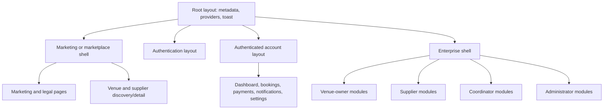

# Low-fidelity wireframes

These diagrams reflect existing information architecture. They are not visual
redesigns. Brackets represent controls; braces represent conditional state.
Mobile variants stack left-to-right regions vertically unless noted.

## Component hierarchy



## 1. Landing page — implemented and runtime-verified

```text
┌ Marketing navigation: brand | destinations | session ┐
│ Hero: value proposition       [Browse venues]         │
│ Venue search: location | date | guests | [Search]     │
├ Featured venue cards ─────────────────────────────────┤
│ How it works / product benefits / partner callout     │
└ Footer: company | hosting | support | legal           ┘
```

Mobile: collapsed navigation, single-column hero/search/cards. Current shell and
page both create `main`; one must become a neutral container.

## 2. Venue marketplace — partially implemented

```text
┌ Public header ─────────────────────────────────────────┐
│ Page title                         [Mobile filters]    │
├ Filters ───────┬ Results/sort ─────────────────────────┤
│ search         │ [Venue card] [Venue card] [Venue card]│
│ municipality   │ [Venue card] [Venue card] [Venue card]│
│ price/capacity │                [Load more]            │
└────────────────┴───────────────────────────────────────┘
```

Mobile: filter drawer above a one-column grid. Load-more must disappear when the
computed remaining count is zero; current runtime can display a negative count.

## 3. Venue details — implemented, source-only

```text
┌ Header / breadcrumbs ──────────────────────────────────┐
│ Gallery or video                  [Favorite]           │
├ Venue identity, rating, location ─┬ Booking sidebar ───┤
│ description / amenities / policy  │ date / guests      │
│ packages / availability           │ package / price    │
│ map / reviews / nearby venues      │ [Start booking]    │
└────────────────────────────────────┴────────────────────┘
```

Mobile: media, identity, sections, then a reachable booking action; avoid a fixed
sidebar covering content.

## 4. Authentication layout — implemented, representative runtime-verified

```text
┌ Brand / back-to-site ──────────────────────────────────┐
│ Optional value panel │ Form title                     │
│                      │ labeled fields                 │
│                      │ error / status                 │
│                      │ [Primary submit]               │
│                      │ secondary auth links           │
└────────────────────────────────────────────────────────┘
```

Mobile: one-column form; decorative value heading must not compete with the form
h1. Password-reveal activation area needs enlargement.

## 5. Customer dashboard — implemented, source-only

```text
┌ Customer navigation / profile / notifications ────────┐
│ Welcome + next required action                        │
├ Booking summary ───┬ Payment/status summary ──────────┤
│ Upcoming activity  │ Favorites / recommendations      │
├ Recent activity tabs ─────────────────────────────────┤
└ Empty or loading state with relevant action ──────────┘
```

## 6. Customer bookings — implemented, source-only

```text
┌ Customer navigation ───────────────────────────────────┐
│ Bookings title | search | venue/supplier view | status│
├ Booking card: venue, date, status, amount, next action┤
├ Booking card: venue, date, status, amount, next action┤
└ Pagination/empty/loading state ────────────────────────┘
```

Status and next-action text must answer whether approval, payment, confirmation,
cancellation, refund, or review is currently available.

## 7. Customer booking detail — implemented, source-only

```text
┌ Booking identity / status / primary next action ──────┐
├ Summary ───────────────┬ Timeline ────────────────────┤
│ venue, event, package  │ requested → approved → paid │
│ amount/payment/refund  │ notification/history entries │
├ Map/event information ─┴───────────────────────────────┤
│ Conversation                                            │
└ [Pay] [Cancel] [Review] {only when eligible} ──────────┘
```

Mobile: one-column status first, then summary/timeline/conversation. Actions must
be conditionally absent—not merely disabled—when resource permissions deny them.

## 8. Venue-owner dashboard — implemented, source-only

```text
┌ Sidebar │ Top bar / notifications / profile ──────────┐
│ Overview│ KPI cards: bookings | revenue | occupancy   │
│ Venues  ├ Recent inquiries ───┬ Upcoming events ──────┤
│ ...     │ performance chart   │ activity/empty state  │
└─────────┴─────────────────────┴────────────────────────┘
```

## 9. Venue management — implemented, source-only

```text
┌ Sidebar │ Venues                      [Create venue]   │
│         ├ Owned venue cards/table: status + actions   │
│         ├ Edit form: identity / address / capacity    │
│         ├ amenities / policies / media uploads        │
│         ├ packages / availability / publishing status│
└─────────┴ [Save draft/update] {validation feedback} ──┘
```

Ownership is enforced by query/RLS and Server Actions. Create/edit are separate
routes but share the same conceptual form regions.

## 10. Venue booking management — implemented, source-only

```text
┌ Sidebar │ Booking filters / list ─────────────────────┐
│         ├ Detail: customer-safe event summary         │
│         ├ availability / quote total / deposit        │
│         ├ timeline / conversation / payment status    │
│         └ [Approve] [Decline] {confirmation + result} │
└────────────────────────────────────────────────────────┘
```

Approval/rejection controls must follow the booking state machine and produce
durable feedback plus notifications.

## 11. Venue analytics — implemented, source-only

```text
┌ Sidebar │ Date/venue filters       [CSV] [PDF]        │
│         ├ Revenue | bookings | occupancy | conversion│
│         ├ Revenue and booking charts                 │
│         ├ Popular packages / detailed table          │
│         └ {loading | no data | retryable error}      │
└────────────────────────────────────────────────────────┘
```

Mobile: cards and charts stack; tables need labeled scrolling/data alternatives.

## 12. Supplier dashboard — implemented, source-only

```text
┌ Sidebar │ Supplier overview / verification status ───┐
│ Profile ├ KPI: inquiries | quotes | jobs | rating    │
│ Services├ New inquiries ─────┬ Upcoming work ────────┤
│ ...     │ performance summary│ availability/action   │
└─────────┴────────────────────┴────────────────────────┘
```

## 13. Supplier inquiry details — implemented, source-only

```text
┌ Sidebar │ Inquiry status / permitted actions ────────┐
│         ├ Event information snapshots               │
│         │ date | time | guests | venue | location    │
│         ├ Customer-safe message thread               │
│         ├ Quote editor / totals / terms              │
│         └ [Save draft] [Send] [Withdraw]             │
└────────────────────────────────────────────────────────┘
```

Protected location snapshots appear only for an eligible supplier relationship
and booking state. Missing values need a safe unavailable label.

## 14. Coordinator dashboard — partially complete, source-only

```text
┌ Sidebar │ Coordinator overview ──────────────────────┐
│ Events  ├ Event summary / workload                  │
│ Venues  ├ Venue and supplier discovery              │
│ Suppliers│ Reports                                  │
└─────────┴ {No dedicated detail, chat, settings} ────┘
```

The implemented family is overview/events/discovery/reports. Do not infer a full
booking coordination or messaging screen.

## 15. Admin dashboard — implemented, source-only

```text
┌ Permission-filtered sidebar │ Platform overview ─────┐
│ Applications / users        ├ KPI and trend summaries│
│ Venues / suppliers          ├ Pending review queues  │
│ Bookings / marketplace      ├ Risk/activity summary  │
│ Reports / configuration     └ Permission-safe exits  │
└────────────────────────────────────────────────────────┘
```

## 16. Admin application review — implemented, source-only

```text
┌ Admin shell │ Application queue / filters ───────────┐
│             ├ Applicant and business summary         │
│             ├ Verification documents [short link]    │
│             ├ Status history / decision context      │
│             └ [Approve] [Reject + required reason]   │
└────────────────────────────────────────────────────────┘
```

Decision controls require `users.verify`, confirmation, result feedback, audit,
and applicant notification.

## 17. Admin roles and permissions — partially complete, source-only

```text
┌ Admin shell │ User/admin detail ─────────────────────┐
│             ├ Current roles and account state        │
│             ├ Admin tier and derived permissions     │
│             ├ Reason / safety warning                │
│             └ [Assign supported tier]                │
└────────────────────────────────────────────────────────┘
```

Tier assignment is implemented with `admin_roles.manage`; a complete arbitrary
per-user permission editor is not evidenced.

## 18. Admin payment monitoring — missing dedicated screen

```text
┌ Admin shell │ Existing distributed evidence ─────────┐
│ Bookings    ├ booking/payment status                 │
│ Reports     ├ aggregate reporting                    │
│ Commissions├ commission state                       │
│             └ {No dedicated transactions/refunds/   │
│                webhook reconciliation workspace}     │
└────────────────────────────────────────────────────────┘
```

This is a gap diagram, not a proposed implemented route. Payment evidence exists
in backend and adjacent modules.

## 19. Admin disputes — scoped case list

```text
┌ Admin shell │ Disputes ──────────────────────────────┐
│             │ KPIs: open / under review / resolved   │
│             │ Status filter + cases table            │
│             │ Row → Open case (detail + actions)     │
└─────────────┴─────────────────────────────────────────┘
```

## 20. Notification inbox — implemented, source-only

```text
┌ Customer header │ Notifications / unread count ─────┐
│                 ├ Filters: all | unread | kinds      │
│                 ├ Notification row + timestamp/action│
│                 ├ Notification row + timestamp/action│
│                 └ [Mark all read] {empty/loading/error}│
└────────────────────────────────────────────────────────┘
```

## 21. Mobile navigation — implemented with accessibility gap

```text
┌ Brand                          [Menu trigger] ┐
├ Overlay/drawer ───────────────────────────────┤
│ Current role / profile                         │
│ Destination                                   │
│ Destination                                   │
│ Notification / settings / sign out            │
│                                  [Close]       │
└────────────────────────────────────────────────┘
```

Required behavior: named dialog/drawer, contained focus, Escape close, background
inertness, current location, and trigger-focus restoration.

## 22. Desktop sidebar — implemented, source-only

```text
┌ Brand / role ─────────┐┌ Top bar: title | bell | user ┐
│ Current destination  ││                               │
│ Allowed destination  ││ Main content                  │
│ Allowed destination  ││                               │
│ ... permission-filter││                               │
│ Profile / sign out   ││                               │
└──────────────────────┘└───────────────────────────────┘
```

## 23. Empty state — implemented inconsistently

```text
┌ Collection title / allowed actions ──────────────────┐
│                                                      │
│              [simple illustration/icon]              │
│              No matching {entity}                    │
│              Explanation / filter context            │
│              [Clear filters or allowed create]       │
└──────────────────────────────────────────────────────┘
```

## 24. Permission-denied state — implemented and runtime-verified

```text
┌ Venora brand / safe public context ──────────────────┐
│                       Unauthorized                    │
│              You do not have access                  │
│              [Go to allowed dashboard/home]          │
└──────────────────────────────────────────────────────┘
```

Add a primary `main` landmark; never reveal the existence or contents of the
denied resource.

## 25. General error state — missing shared screen

```text
┌ Existing shell when safe ────────────────────────────┐
│              Something could not be loaded           │
│              Safe, non-technical explanation         │
│              [Try again] [Go to stable destination]  │
│              Reference ID only if privacy-safe       │
└──────────────────────────────────────────────────────┘
```

No route-level `error.tsx` currently provides this contract.

## 26. Not-found state — missing custom screen

```text
┌ Public shell ─────────────────────────────────────────┐
│              We could not find that page             │
│              [Browse venues] [Go home]                │
│              Optional site search                    │
└──────────────────────────────────────────────────────┘
```

The browser currently receives the framework default 404 rather than this
Venora-specific recovery structure.
