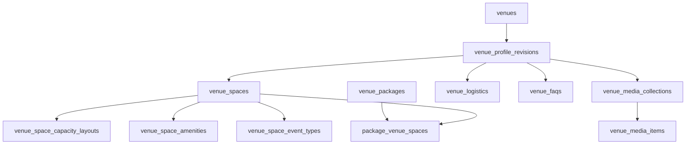

# Structured Venue Foundation

Status: implemented through repository/server-action contracts; live local RLS verification blocked by unavailable Docker engine on 2026-07-31.

Phase 2.2 adds the data foundation for future immersive venue profiles. It does not add the venue-owner structured editor UI and does not redesign the public venue page.

## Tables

- `venue_profile_revisions`: draft, published, and archived structured profile containers per venue.
- `venue_spaces`: venue spaces tied to a profile revision.
- `venue_space_capacity_layouts`: capacity per space layout.
- `venue_space_amenities`: space-level amenity taxonomy links.
- `venue_space_event_types`: space-level event-type taxonomy links.
- `venue_media_collections`: grouped media collections for hero, gallery, space gallery, video, and logistics media.
- `venue_media_items`: structured image/video metadata linked to collections.
- `venue_logistics`: parking, accessibility, loading, supplier, policy, weather, and venue operations details.
- `venue_faqs`: structured venue FAQ rows.
- `package_venue_spaces`: optional package-to-space relationships.

## Publication Model

`venue_profile_revisions` is the publication boundary.

- Draft rows are private to authorized owners/admins and assigned coordinators with the right permission.
- Published rows are public-readable through RLS.
- Archived rows are retained but not treated as current public content.
- A venue can have one active draft revision and one current published revision.
- Publishing archives the previous published revision and marks related draft children as published.

## Relationship Shape

## Repository Contracts

Structured venue repository methods live in:

- `apps/web/src/features/venues/application/structured-profile-repository.ts`

Contracts:

- Public aggregate reads return `null` when no published structured profile exists.
- Draft-only structured content is not returned through the published aggregate.
- Published aggregate reads include revision, spaces, media collections, media items, logistics, FAQs, and package-space relationships.
- Package-space relationships are optional; existing packages remain valid without them.
- Structured media is optional; existing `venue_images` remains the gallery fallback.
- Repository errors are mapped to safe messages instead of leaking raw Supabase errors.

## Server-Action Contracts

Structured venue server actions live in:

- `apps/web/src/features/venues/application/structured-profile-actions.ts`

Contracts:

- Mutations derive user and ownership server-side.
- Unauthenticated users are denied.
- Customers and suppliers cannot write structured venue content.
- Owners can manage their own venue drafts.
- Coordinators require active venue assignment plus explicit permission.
- Coordinators cannot publish.
- Owner/admin publication is routed through server actions and repository methods.
- Route revalidation is scoped to dashboard and public venue paths.

## Backward Compatibility

Existing public venue behavior remains the fallback path.

- No structured revision: current venue details, gallery, packages, reviews, map, inquiry, and booking behavior stay usable.
- Draft-only revision: existing public page remains unchanged and draft identifiers are not disclosed.
- Published revision: structured data can be loaded by future UI while legacy venue data remains available as fallback.
- Archived revision: not returned as current public structured content.
- Existing packages do not require `package_venue_spaces`.
- Existing venue images do not require migration into `venue_media_collections`.

## Generated Types

Database types are maintained in:

- `packages/database/types/generated.ts`

The repository convention currently allows narrow hand-maintained extensions when the local generator cannot be run safely. Phase 2.2 added Row, Insert, and Update types for all structured tables from the committed migration definitions and extended the database contract validator to check those fields.

## Deferred Work

Deferred to later phases:

- Complete venue-owner structured editor.
- Public immersive venue profile UI.
- Accommodation, dining, showcases, maps, floor plans, 360 tours, and site visits.
- Event Plan fit UI and numeric match explanations.
- Public package customization redesign.
