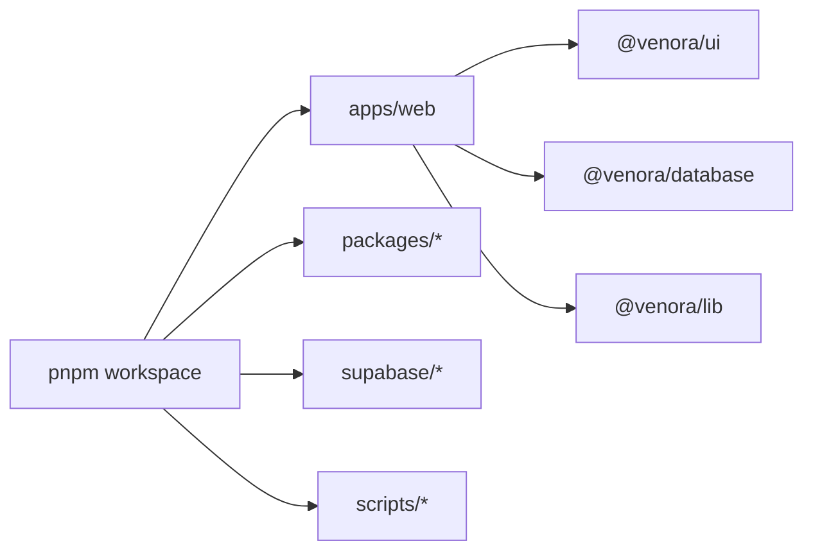

# Repository Structure

Venora is a pnpm workspace orchestrated by Turborepo. It is feature-first in the
web app, with partial domain/application/infrastructure layering where useful;
it is not a uniformly implemented Clean Architecture repository.

```text
apps/web/
  app/                  Next.js App Router pages, layouts, Route Handlers
  src/components/       Application-wide web components
  src/features/         Feature UI, schemas, actions, queries, domain/adapters
  src/lib/              Supabase clients, RBAC, site and shared web utilities
  e2e/                  Playwright specs and fixtures
  public/               Static web assets
packages/
  ui/                   Shared design-system components
  database/             Generated Supabase TypeScript types
  lib/                  Framework-light shared utilities
  config/               Shared TypeScript/ESLint/Tailwind configuration
supabase/
  migrations/           Ordered PostgreSQL schema and policy history
  functions/            Deno Edge Functions plus _shared helpers
  seed.sql              Local deterministic seed
scripts/                 Validators and safe SQL-printing helpers
docs/                    Canonical, API, design, historical, and runbook docs
```



## Placement rules

| Change                                | Preferred location                                     |
| ------------------------------------- | ------------------------------------------------------ |
| Route/page/layout/HTTP handler        | `apps/web/app/` in the matching route group            |
| Feature UI, actions, queries, schemas | `apps/web/src/features/<feature>/`                     |
| Cross-feature web component           | `apps/web/src/components/`                             |
| Reusable design primitive             | `packages/ui/`                                         |
| Server-only shared web logic          | server-only feature module or `apps/web/src/lib/`      |
| Supabase client/adaptor               | `apps/web/src/lib/supabase/` or feature infrastructure |
| Database change                       | new `supabase/migrations/*.sql` file                   |
| Edge API                              | `supabase/functions/<function>/` with `_shared/` reuse |
| Unit/integration test                 | next to the module or its existing test directory      |
| Browser test                          | `apps/web/e2e/`                                        |
| Operational/architecture doc          | `docs/`; API/design changes in their existing suites   |

Route groups currently include marketing, auth, customer, venue-owner, supplier,
event-coordinator, and admin areas. Server Actions live inside feature
application/actions modules; Route Handlers live in `app/api/**/route.ts`.
Client Components must not import service-role clients or server secrets.

`packages/database/types/generated.ts` is generated and must not be edited by
hand. `docs/api/openapi.json` is generated by `pnpm docs:generate`. Migration
files are immutable history once applied. The API and design inventories are
authoritative for public contracts and screens.

Legacy/transitional locations—`docs/api-contracts.md`, `docs/modules/`, and
`docs/deployment/vercel.md`—exist for old links and point to current guides.
Historical feature specifications and plans describe their date/commit, not
necessarily present behavior.

Improvement opportunities include making module boundaries more consistent,
refreshing database types after migration history is repaired, centralizing API
envelopes/rate limiting, and adding repository-owned deployment workflows.
